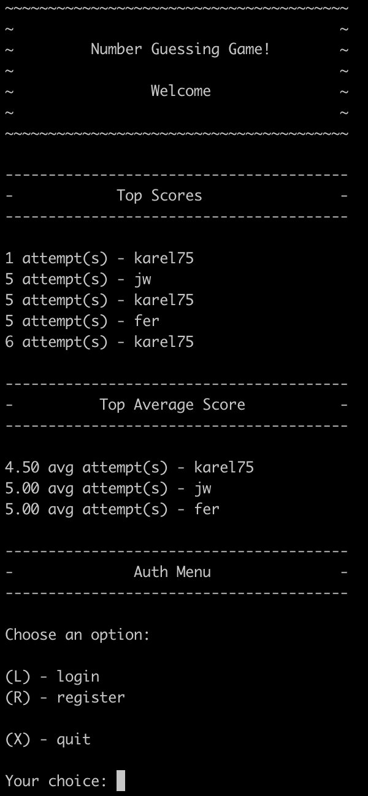

# Assigment

Add the following functionality to the Number Guessing game using the concepts of the last few days regarding Database and querying (SQL). Use the database we've created today for the games and players tables. Expand this database (more tables or additional attributes (columns) in existing tables). Make sure that you can:

-   Register (can't have duplicate username & password combinations)
-   Login
-   Main menu
    -   1: summary of logged in used games
    -   2: start new game
    -   u: update account data
    -   d: delete account
    -   x: quit program
-   DB Players
    -   Nickname, username, password
-   DB Games
    -   when it started, when it ended
-   DB Guesses
    -   keep track of each number guesses, date & time
-   After login: show top player name(s) + score(s)
    -   if no data, don't show anything
-   After login, show:
    -   top player name(s) least amont of tries in a single game
    -   top player name(s) lowest average score(s)
    -   if no data, don't show anything
-   Replay (yes / no)
    -   yes start new game
    -   no loads main menu
-   Validation errors, retry giving correct input

Note: don't forget to include your package.json when submitting your assignment

# Solution

## Installation

-   Create a database
-   Use [migration.sql](migration.sql) to create the tables
-   Run `npm install` to install dependencies.
-   Update database config in [index.js](index.js):
    -   host: "YOUR_DATABASE_HOST",
    -   user: "YOUR_DATABASE_USER",
    -   database: "YOUR_DATABASE_NAME",
    -   ...
-   Run `node index.js` to start game

## Screenshot

