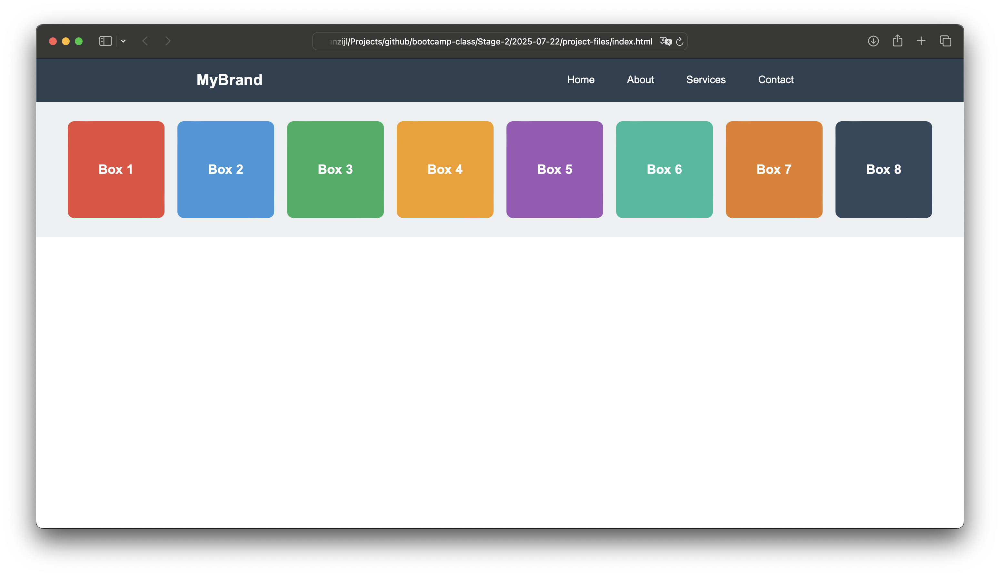
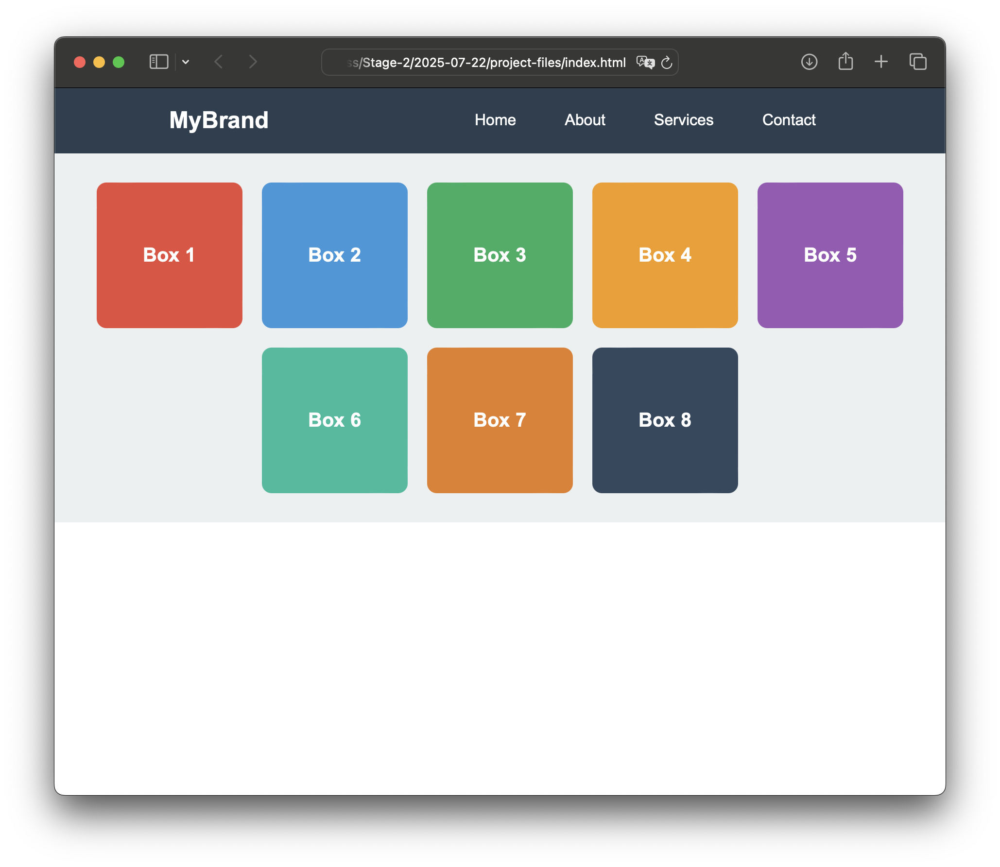
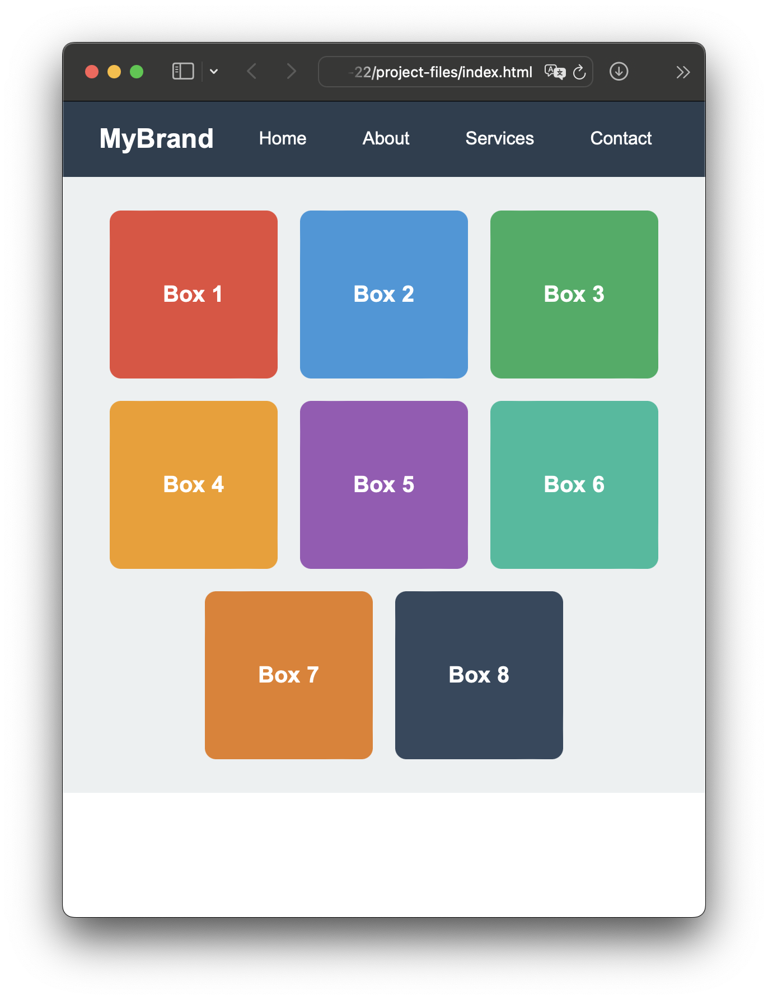
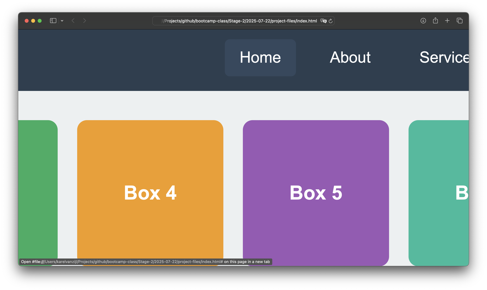
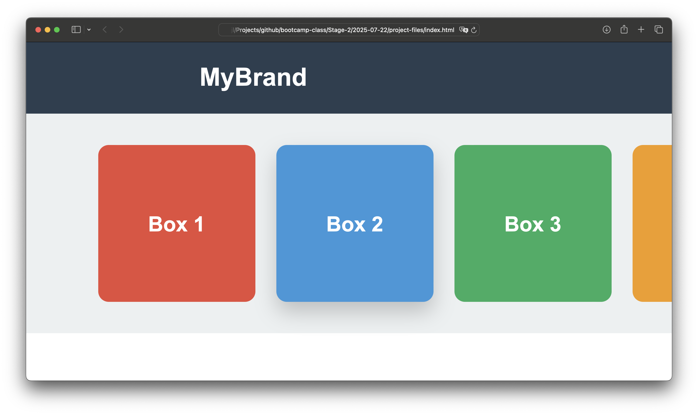

## Navigation

1. [Overview](readme.md)
2. [CSS Positioning](01-positioning.md)
3. [Flexbox Fundamentals](02-flexbox.md)
4. [Project: Flexbox Menu & Boxes](03-project.md) ← _You are here_

---

# Project: Flexbox Menu & Boxes

## Project Overview

In this project, you'll recreate a responsive webpage with a navigation menu and a grid of colored boxes. This project combines positioning and flexbox concepts you've learned to build a real-world layout.

**Goal:** Build a responsive webpage with a top navigation bar and a flexible grid of colored boxes.

## What You'll Build

-   **Top Navigation Bar**: A horizontal menu with brand logo and navigation links
-   **Responsive Box Grid**: A collection of colored boxes that adapt to different screen sizes
-   **Clean Layout**: Professional styling with proper spacing and alignment

### Visual Examples

**Wide Screen Layout:**

**Less Wide Screen (boxes wrapping):**

**Small Screen Layout:**

**Navigation Hover Effect: (see Home link)**

**Box Hover Effect (see box 2):**

## Task Checklist

### Phase 1: Navigation Bar Setup

-   [ ] **Create the basic HTML structure**

    -   Add a `.menu` container with brand and navigation links
    -   Include brand name and 4 navigation links (Home, About, Services, Contact)

-   [ ] **Style the navigation bar**

    -   Set background color to `#2c3e50`
    -   Add white text color
    -   Apply padding: `15px 20px`

-   [ ] **Implement flexbox for the navigation**

    -   Make `.menu` a flex container
    -   Use `justify-content: space-between` to separate brand from links
    -   Center items vertically with `align-items: center`

-   [ ] **Style the navigation links**
    -   Create a `.nav-links` container for the menu items
    -   Make `.nav-links` a flex container
    -   Add `gap: 20px` between links
    -   Style links: white color, no underline, padding `10px 15px`
    -   Add hover effect: change background color to `#34495e` on hover

### Phase 2: Box Grid Layout

-   [ ] **Create the box container**

    -   Add a `.container` div to hold all boxes
    -   Create 8 boxes with class `.box` and individual color classes (`.box1`, `.box2`, etc.)

-   [ ] **Implement flexbox for the grid**

    -   Make `.container` a flex container
    -   Add `flex-wrap: wrap` to allow boxes to wrap to new lines
    -   Use `justify-content: center` to center the boxes
    -   Add `gap: 20px` between boxes

-   [ ] **Style individual boxes**

    -   Set dimensions: `width: 150px`, `height: 150px`
    -   Add `border-radius: 10px` for rounded corners
    -   Make each box a flex container to center its text
    -   Use `align-items: center` and `justify-content: center`

-   [ ] **Apply color schemes**
    -   Box 1: `#e74c3c` (red)
    -   Box 2: `#3498db` (blue)
    -   Box 3: `#27ae60` (green)
    -   Box 4: `#f39c12` (orange)
    -   Box 5: `#9b59b6` (purple)
    -   Box 6: `#1abc9c` (teal)
    -   Box 7: `#e67e22` (dark orange)
    -   Box 8: `#34495e` (dark blue-gray)

### Phase 3: Addidtional Styling

-   [ ] **Container styling**

    -   Add padding: `30px` to the container
    -   Set background color to `#ecf0f1` (light gray)

-   [ ] **Typography**

    -   Apply `font-family: Arial, sans-serif` to body
    -   Set box text: white color, `20px` font size, bold weight
    -   Brand text: `24px` font size, bold weight

### Phase 4: Final Polish

-   [ ] **Clean up margins**

    -   Remove default body margin: `margin: 0`
    -   Ensure consistent spacing throughout

-   [ ] **Review accessibility**
    -   Check color contrast for readability
    -   Ensure navigation links are properly styled
    -   Verify semantic HTML structure

## Learning Objectives Covered

**CSS Positioning**

-   Understanding document flow
-   Working with margins and padding

**Flexbox Container Properties**

-   `display: flex`
-   `justify-content` (space-between, center)
-   `align-items: center`
-   `flex-wrap: wrap`
-   `gap` property

**Flexbox Item Behavior**

-   How items flow and wrap
-   Centering content within flex items

**Responsive Design**

-   Creating layouts that adapt to different screen sizes
-   Using flexbox for responsive grids

## Bonus Challenges

Once you complete the basic project, try these additional challenges:

1. **Box Variations**

    - Experiment with different `flex-basis` values for boxes
    - Try different `justify-content` values for the container
    - Add more boxes and observe the wrapping behavior

2. **Alternative Layouts**
    - Create a version using `justify-content: space-around`
    - Try `justify-content: space-evenly`
    - Experiment with different gap values

## Tips for Success

-   **Start simple**: Build the basic structure first, then add styling
-   **Test frequently**: Check your layout in the browser after each major change
-   **Use dev tools**: Right-click and inspect elements to see flexbox properties
-   **Experiment**: Try different flexbox values to understand their effects
-   **Mobile first**: Test how your layout looks on narrow screens

## Common Issues & Solutions

**Problem**: Boxes not centering properly
**Solution**: Check that both container has `justify-content: center` and individual boxes use flexbox centering

**Problem**: Navigation links not spacing correctly  
**Solution**: Ensure `.nav-links` is a flex container with `gap` property

**Problem**: Boxes not wrapping to new lines
**Solution**: Make sure container has `flex-wrap: wrap`

---

## Good luck!
