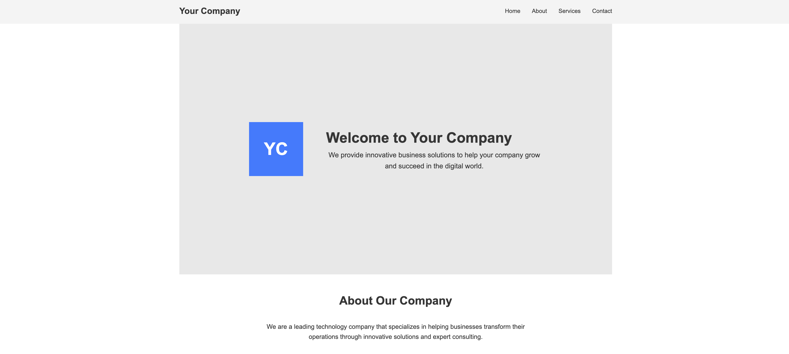
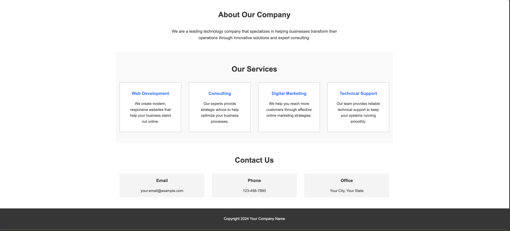
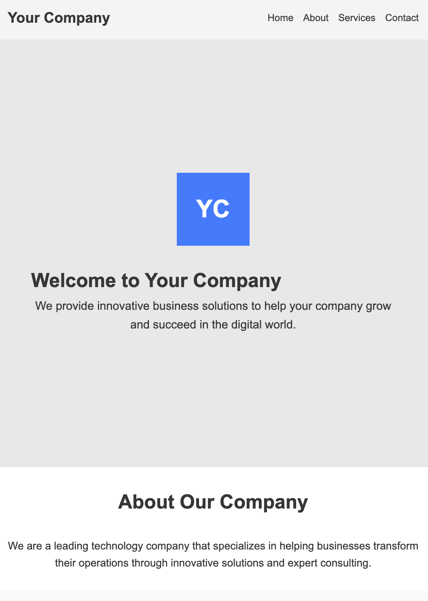
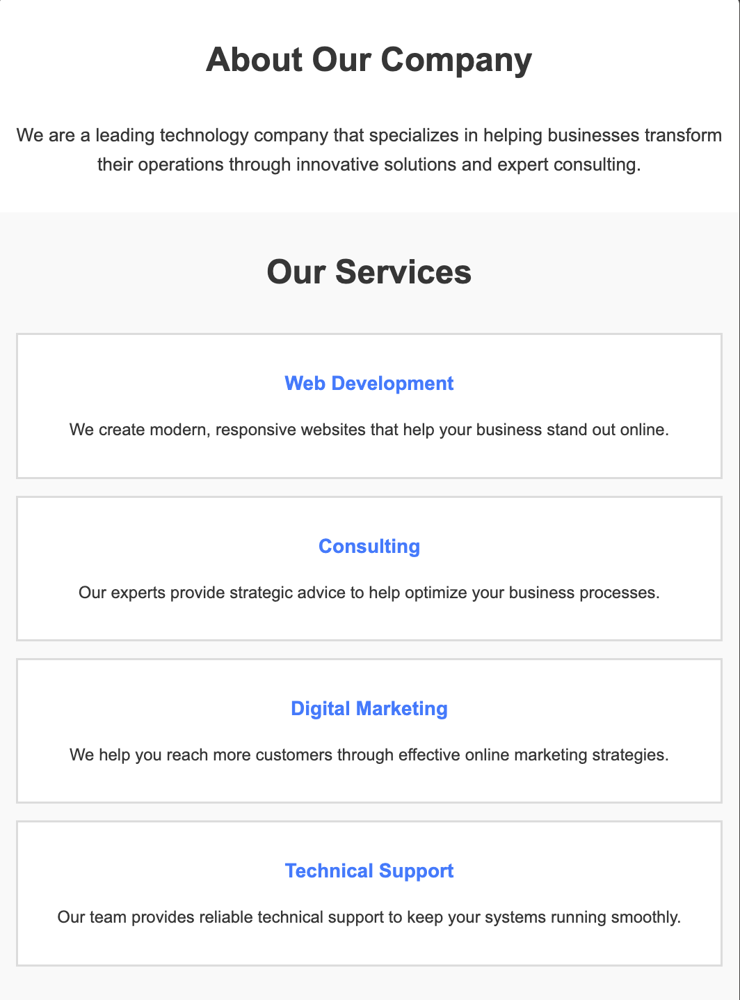
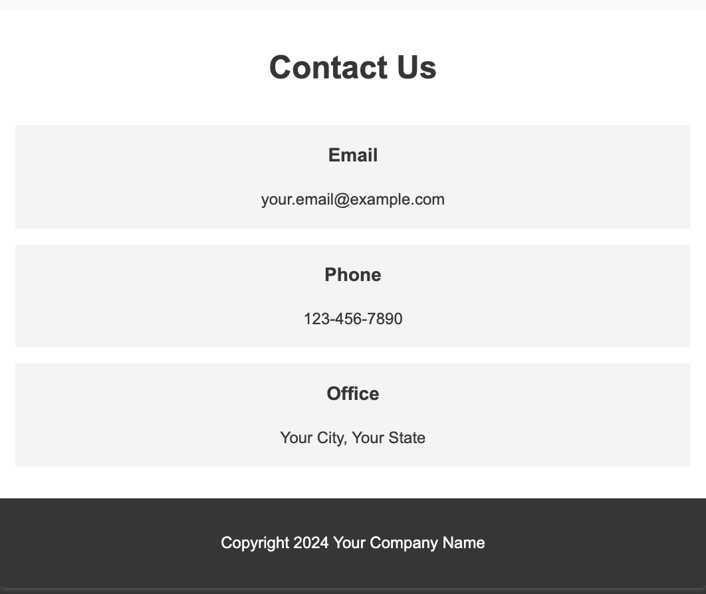
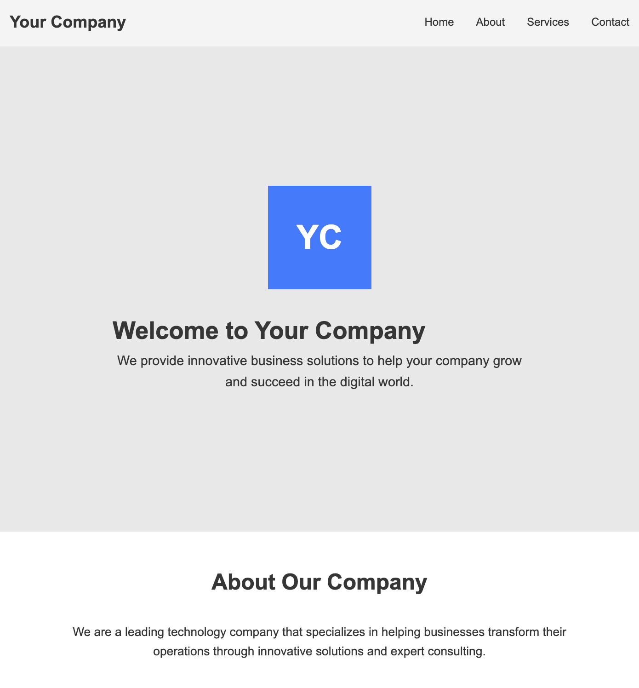
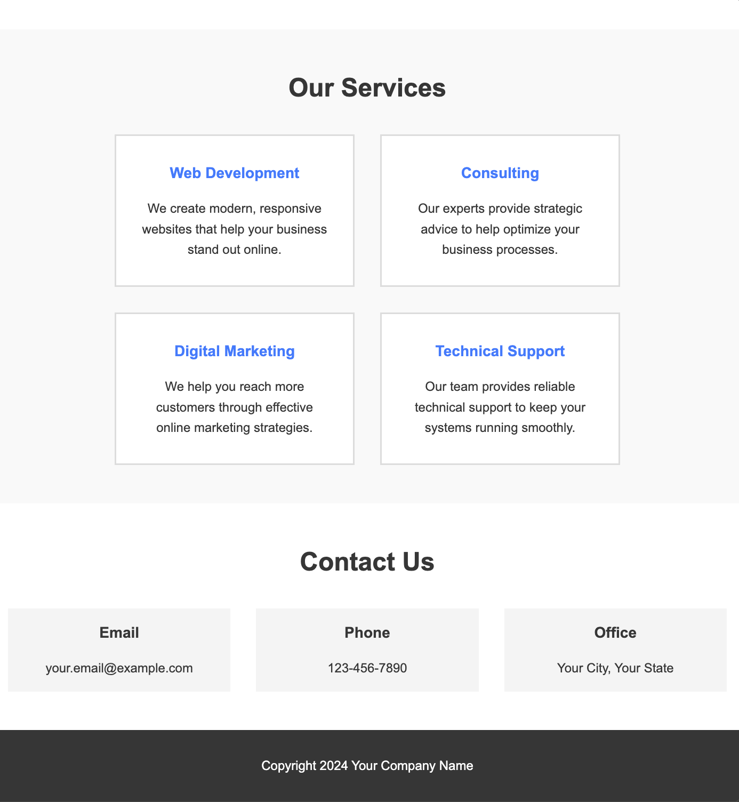

# Simple Business Landing Page - CSS Assignment

## Project Overview

You will create a simple one-page business landing page by writing CSS for the provided HTML structure. This project will help you practice using flexbox layouts and responsive design with media queries.

-   Read instructions carefully
-   Submit your work before the deadline
-   Focus on applying learned concepts
-   Create a responsive webpage

**Remember:**

-   We expect you to only write the CSS code, not the HTML structure.
-   We expect you to submit a single CSS file with all your styles.

**Estimated Time:** 4 hours

**Difficulty:** Beginner (Week 1 HTML/CSS)

## Learning Goals

-   Practice CSS flexbox layouts
-   Learn responsive design with media queries
-   Style a complete webpage from scratch
-   Understand how to structure CSS for different screen sizes

## Expected Results- Visual Examples

### Desktop View (1024px+)




### Mobile View (up to 768px)





## Instructions

### Step 1: Setup

1. Create a new folder called `business-landing`
2. Save the HTML code below as `index.html`
3. Create a new file called `style.css`
4. Link your CSS file to the HTML (already done in the provided code)

### Step 2: HTML Structure (Provided)

Copy this HTML code into your `index.html` file:

```html
<!DOCTYPE html>
<html lang="en">
    <head>
        <meta charset="UTF-8" />
        <meta name="viewport" content="width=device-width, initial-scale=1.0" />
        <title>Your Company - Business Solutions</title>
        <link rel="stylesheet" href="style.css" />
    </head>
    <body>
        <header>
            <div class="header-container">
                <div class="logo">Your Company</div>
                <nav>
                    <ul>
                        <li><a href="#home">Home</a></li>
                        <li><a href="#about">About</a></li>
                        <li><a href="#services">Services</a></li>
                        <li><a href="#contact">Contact</a></li>
                    </ul>
                </nav>
            </div>
        </header>

        <main>
            <section class="hero section" id="home">
                <div class="hero-content">
                    <div class="hero-image">YC</div>
                    <div class="hero-text">
                        <h1>Welcome to Your Company</h1>
                        <p>
                            We provide innovative business solutions to help
                            your company grow and succeed in the digital world.
                        </p>
                    </div>
                </div>
            </section>

            <section class="about section" id="about">
                <h2>About Our Company</h2>
                <p>
                    We are a leading technology company that specializes in
                    helping businesses transform their operations through
                    innovative solutions and expert consulting.
                </p>
            </section>

            <section class="services section" id="services">
                <h2>Our Services</h2>
                <div class="services-grid">
                    <div class="service-item">
                        <h3>Web Development</h3>
                        <p>
                            We create modern, responsive websites that help your
                            business stand out online.
                        </p>
                    </div>
                    <div class="service-item">
                        <h3>Consulting</h3>
                        <p>
                            Our experts provide strategic advice to help
                            optimize your business processes.
                        </p>
                    </div>
                    <div class="service-item">
                        <h3>Digital Marketing</h3>
                        <p>
                            We help you reach more customers through effective
                            online marketing strategies.
                        </p>
                    </div>
                    <div class="service-item">
                        <h3>Technical Support</h3>
                        <p>
                            Our team provides reliable technical support to keep
                            your systems running smoothly.
                        </p>
                    </div>
                </div>
            </section>

            <section class="contact section" id="contact">
                <h2>Contact Us</h2>
                <div class="contact-info">
                    <div class="contact-item">
                        <h3>Email</h3>
                        <p>your.email@example.com</p>
                    </div>
                    <div class="contact-item">
                        <h3>Phone</h3>
                        <p>123-456-7890</p>
                    </div>
                    <div class="contact-item">
                        <h3>Office</h3>
                        <p>Your City, Your State</p>
                    </div>
                </div>
            </section>
        </main>

        <footer>
            <p>Copyright 2024 Your Company Name</p>
        </footer>
    </body>
</html>
```

### Step 3: Your CSS Task

Create the CSS file (`style.css`) that will style this HTML. Follow these requirements:

## Required Styling Tasks

**💡 Note: You are welcome to create your own design, especially when it comes to choosing colors. Everywhere it says color, feel free to use your favorite shades that fit your style!**

### 1. Basic Reset & Body

-   Remove all default margins and padding from all elements
-   Set all elements to use border-box for box-sizing
-   Choose a font family for the entire page
-   Set a text color for the body

### 2. Header Section

-   Give the header a light gray background color
-   Make the header-container use flexbox
-   Position the logo on the left and navigation on the right
-   Remove bullets from the navigation list
-   Make the navigation links display horizontally (use flexbox)
-   Remove underlines from navigation links
-   Add a hover effect that changes link color

### 3. Section Styling

-   Give all sections with class "section" some padding and center them
-   Set a maximum width so content doesn't stretch too wide on large screens

### 4. Hero Section

-   Give the hero section a light background color
-   Use flexbox to center all content vertically and horizontally
-   Style the hero-image div:
    -   Make it a square shape (same width and height)
    -   Give it a blue background color
    -   Center the text inside it
    -   Make the text white and large
-   Make the hero text readable with good font sizes

### 5. About Section

-   Give it a white background
-   Center the heading
-   Center the paragraph text
-   Limit the paragraph width so it's easy to read

### 6. Services Section

-   Give it a light gray background (different from hero)
-   Center the heading
-   Make the services-grid use flexbox
-   Allow the services to wrap to new lines
-   Make each service-item:
    -   Have a white background
    -   Equal width when possible
    -   Have some padding inside
    -   Have a border around it
    -   Be at least 250px wide
    -   Center the text inside

### 7. Contact Section

-   White background
-   Center the heading
-   Make contact-info use flexbox
-   Make contact items spread out evenly
-   Give each contact-item a light background color
-   Add padding to contact items

### 8. Footer

-   Dark background color
-   White text
-   Center the text
-   Add padding

## Responsive Design Requirements

You need to create TWO media queries for this assignment:

### Mobile (max-width: 768px)

-   Make navigation links smaller or stack if needed
-   Reduce hero heading size
-   Make hero image smaller
-   Reduce section padding
-   Make service items take full width
-   Stack contact items vertically

### Desktop (1024px and up)

-   Make hero content side-by-side instead of stacked
-   Ensure services grid shows multiple items per row
-   Use full layout widths

## Color Suggestions

Use these colors or choose your own simple color scheme:

-   Text: dark gray or black
-   Backgrounds: white, light gray, medium gray
-   Keep it simple - don't use more than 4 colors total

## Success Checklist

-   [ ] Header navigation is horizontal and properly aligned
-   [ ] Hero section content is centered on the page
-   [ ] Services appear in a grid that wraps appropriately
-   [ ] Contact information is evenly distributed
-   [ ] Website works on mobile phones (under 768px width)
-   [ ] Website works on desktop computers (over 1024px width)
-   [ ] All text is readable with good contrast
-   [ ] Spacing looks consistent throughout

## Tips for Success

1. **Start with desktop** - Get the basic layout working first
2. **Use browser developer tools** - Right-click and "Inspect" to see your CSS
3. **Test frequently** - Refresh your browser often to see changes
4. **One section at a time** - Don't try to style everything at once
5. **Use simple colors** - Focus on layout first, colors second

## Common Issues to Watch For

-   Forgetting to use `display: flex` on container elements
-   Not removing default list styling from navigation
-   Forgetting to add `flex-wrap` when you want items to wrap
-   Not testing on mobile sizes
-   Making text too small to read on mobile

## What You're Learning

-   How to use flexbox for modern layouts
-   How to make websites work on different screen sizes
-   How to organize CSS code
-   How to style a complete webpage from scratch

## Challenge Task (Extra Credit)

### Tablet Breakpoint

If you finish early and want an extra challenge, add a third media query for tablet devices:


_Tablet view - hero and services sections_


_Tablet view - contact and footer sections_

```css
@media (min-width: 768px) and (max-width: 1024px) {
    /* Your tablet styles here */
}
```

**Tablet Requirements:**

-   Adjust hero heading size for medium screens
-   Keep services in a flexible grid (2 items per row)
-   Maintain good spacing between elements
-   Make sure navigation still looks good

This challenge will help you understand how to create smooth transitions between different device sizes!

---

**Remember:** The goal is to practice flexbox and responsive design. Don't worry about making it perfect - focus on getting the layouts working correctly! :))
