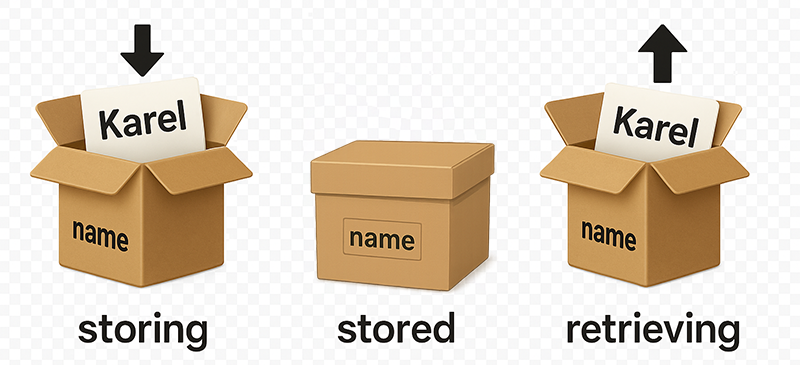

## Navigation

1. [Overview](readme.md)
2. [JavaScript Introduction](01-javascript-introduction.md)
3. [JavaScript in HTML](./02-javascript-in-browser.md)
4. [JavaScript Variables](./03-javascript-variables.md) ← _You are here_
5. [JavaScript Functions](./04-javascript-functions.md)
6. [Quick Quiz](./05-quick-quiz.md)
7. [Exercise: change text](./06-exercise-and-html.md)
8. [Exercise: speed calculator](./07-exercise-speed-calculator.md)

---

# Javascript Variables

Variables are one of the most fundamental concepts in JavaScript, actually for every programming language out there.

In programming we use a variable to store data temporarily in the computer's memory. At a later point in time we can access this data and use it in our program.

#### Definition

> _A variable is a named storage location in memory that can hold a value._

So we store the data somewhere in the computer's memory and give it a name. With this name we can access the data in our program in the future.

#### Analogy

Think of a variable as a labeled box where you can store different items (data) and retrieve them later using the label (variable name).

1. **Label**: The name of the variable.
2. **Box**: The storage location in memory.
3. **Item**: The value stored in the variable.



-   **Store**: First we store an item in the box (assign a value to the variable).
-   **Retrieve**: Later we can retrieve the item from the box (access the variable's value) when we need it.

#### Deja Vu

Remember the [calculator](https://status200.my/bootcamp/practice/2025-07-28/basic-calculator.html) we showed in the previous section?
That example used variables to:

-   Stored the numbers entered by the user.
-   Retreived the numbers to perform a calculation.

## Define a Variable

There are two (actually three) ways to define a variable in JavaScript:

```javascript
// Using let
let variableName = value;

// Using const
const variableName = value;
```

**Breakdown:**

-   **`let`** or **`const`**: The keyword used to define the variable.
-   **`variableName`**: The name of the variable, which follows the naming rules. You can choose any name you like, as long as it follows these [rules](#rules). We'll get to that in a moment.
-   **`=`**: The assignment operator, used to assign a value to the variable.
-   **`value`**: The value assigned to the variable, which can be a number, string, boolean, object, array, etc.

**$Note$:** There is a third way to define a variable using the `var` keyword, but it is not recommended for modern JavaScript development due to some limitations and quirks. The `let` and `const` keywords are preferred. But at least you know it exists and won't be surprised if you see it in older code.

We can declare multiple variables in one line, but it's not recommended for readability:

```
let firstName = "John", lastName = "Doe", age = 30;
```

Preferably, declare each variable on a new line for better readability:

```javascript
let firstName = "John";
let lastName = "Doe";
let age = 30;
```

### Let vs Const

#### `let`

Used to declare variables that can be reassigned later. It has block scope, meaning it is only accessible within the block it is defined in.

#### `const`

Used to declare variables that cannot be reassigned. However, if the variable holds an object or array, the contents of that object or array can still be modified. More on this later.

## Experiment with `let` and `const`

### Setup

1. Create a new folder called `js-variables-experiment`
2. Create a subfolder called `js`
3. Create a file `index.html` in the main folder
4. Create a file `scripts.js` in the `js` folder
5. Open the project folder in VS Code
6. Add HTML boilerplate to `index.html`
7. Link the JavaScript file to the HTML file by adding the following line just before the closing `</body>` tag in your `index.html` file:

```html
<script src="js/scripts.js"></script>
```

### Experiment 1

-   **Step 1: Declare a variable using `let` without assigning a value**

    ```javascript
    // Declare a variable named 'name' without assigning a value
    let name;
    ```

-   **Step 2: Log the value of the variable to the console**

    ```javascript
    // Log the value of 'name' to the console
    console.log(name);
    ```

-   **Step 3: Refresh the browser and check the console**
    ```javascript
    You should see the output: undefined
    ```
-   **$Note$:** _when we declared the variable `name` without assigning a value, it was automatically assigned the value `undefined`. This is a special value in JavaScript that indicates that a variable has been declared but not yet assigned a value._
    &nbsp;
-   **Step 4: Assign a value to the variable**

    ```javascript
    // Assign a value to the variable 'name'
    name = "John Doe";
    ```

-   **Step 5: Log the value of the variable to the console again**

    ```javascript
    // Log the value of 'name' to the console again
    console.log(name);
    ```

-   **Step 6: Refresh the browser and check the console**

    ```javascript
    You should see the output: "John Doe"
    ```

### Experiment 2

Empty your JavaScript file and add the following code step by step.

-   **Step 1:** Declare a variable using `let` and assign a value

    ```javascript
    // Declare a variable named 'name' and assign a value
    let name = "John Doe";
    ```

-   **Step 2: Log the value of the variable to the console**

    ```javascript
    // Log the value of 'name' to the console
    console.log(name);
    ```

-   **Step 3: Refresh the browser and check the console**

    ```javascript
    You should see the output: "John Doe"
    ```

-   **Step 4: Reassign a new value to the variable**

    ```javascript
    // Reassign a new value to the variable 'name'
    name = "Jane Smith";
    ```

-   **Step 5: Log the new value of the variable to the console**

    ```javascript
    // Log the new value of 'name' to the console
    console.log(name);
    ```

-   **Step 6: Refresh the browser and check the console**

    ```javascript
    You should see the output: "Jane Smith"
    ```

-   **$Note$:** _When we declared the variable `name` using `let`, we were able to reassign a new value to it later. This is because `let` allows variables to be reassigned._

### Experiment 3

Empty your JavaScript file and add the following code step by step.

-   **Step 1: Declare a variable using `const` without assigning a value**

    ```javascript
    // Declare a constant named 'pi' without assigning a value
    const pi;
    ```

-   **Step 2: Log the value of the variable to the console**

    ```javascript
    // Log the value of 'pi' to the console
    console.log(pi);
    ```

-   **Step 3: Refresh the browser and check the console**

    ```javascript
    You should see an error in the console, something like:
    "SyntaxError: Missing initializer in const declaration"
    ```

-   **$Note$:** _When we declared the variable `pi` using `const`, we must assign a value to it immediately. This is because `const` requires an initializer (a value) when declaring a variable._
    &nbsp;

-   **$Note$:** The error message will also tell you in which file and what line of the code the error occurred.
    &nbsp;

-   **Step 4:** Assign a value to the constant `pi` during the declaration

    ```javascript
    // Replace the previous declaration with this one
    const pi = 3.14;
    ```

-   **Step 5: Refresh the browser and check the console**

    ```javascript
    You should see the output: 3.14
    ```

-   **Step 6: Attempt to reassign a new value to the variable**

    ```javascript
    // Attempt to reassign a new value to the constant 'pi'
    pi = 3.14159;
    ```

-   **Step 7: Log the value of the variable to the console**

    ```javascript
    // Log the value of 'pi' to the console
    console.log(pi);
    ```

-   **Step 8: Refresh the browser and check the console**

    ```javascript
    You should see an error in the console, something like:
    "TypeError: Assignment to constant variable."
    ```

-   **$Note$:** _When we declared the variable `pi` using `const`, we were not able to reassign a new value to it later. This is because `const` does not allow variables to be reassigned._

## Rules

When defining variables in JavaScript, there are some rules to follow when naming them:

#### 1. Variable name can not start with a number.

```javascript
let 1stName = "John"; // Invalid
```

#### 2. Variable name must not contain spaces.

```javascript
let first name = "John"; // Invalid
```

#### 3. Variable name can only contain letters, numbers, underscores (`_`), and dollar signs (`$`).

```javascript
let first-name = "John"; // Invalid
let firstName$ = "John"; // Valid
let first_name = "John"; // Valid
let firstName1 = "John"; // Valid
```

#### 4. Can not use reserved keywords.

```javascript
let let = "John"; // Invalid
let const = "John"; // Invalid
let return = "John"; // Invalid
let function = "John"; // Invalid
let false = "John"; // Invalid
```

There are many reserved keywords in JavaScript, you can find the full list in the [MDN documentation](https://developer.mozilla.org/en-US/docs/Web/JavaScript/Reference/Lexical_grammar#keywords).

Don't worry about memorizing them all, generally you will not use them as variable names and your IDE (Integrated Development Environment), like VS Code, will warn you if you try to use a reserved keyword as a variable name.

#### 5. Variable names are case-sensitive.

```javascript
let myVariable = "John"; // Valid
let myvariable = "Doe"; // Valid, but different variable
console.log(myVariable); // Output: "John"
console.log(myvariable); // Output: "Doe"
```

#### 6. Use descriptive names.

```javascript
let x = "John"; // Not descriptive
let firstName = "John"; // Descriptive
```

#### 7. Use `camelCase` for multi-word variable names.

```javascript
let first_name = "John"; // Not camelCase
let firstName = "John"; // CamelCase
```

**$Note$:** CamelCase is a naming convention where _**the first letter of each word is capitalized**, **except for the first word**_. This makes it easier to read and understand variable names, especially when they consist of multiple words.

It also helps you to prevent naming conflicts with other variables, like case sensitivity.

#### 8. Use `let` for variables that will change and `const` for variables that will not change.

```javascript
let age = 30; // Variable that can change
const pi = 3.14; // Constant that will not change
```
