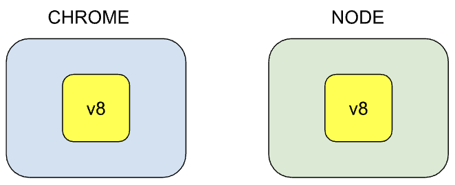
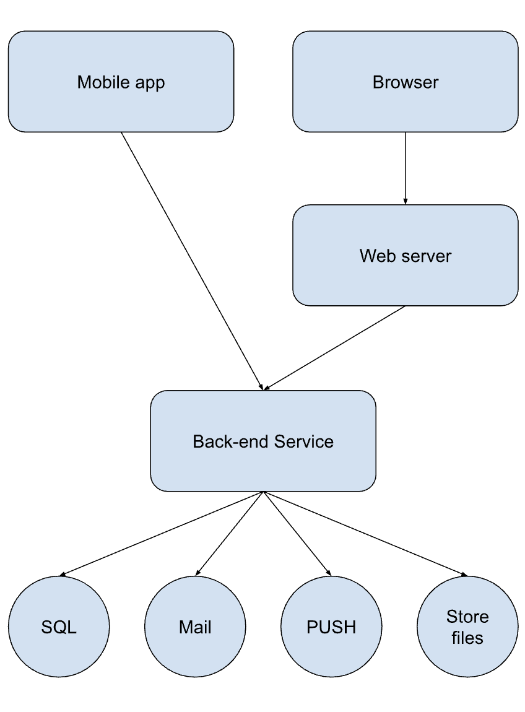
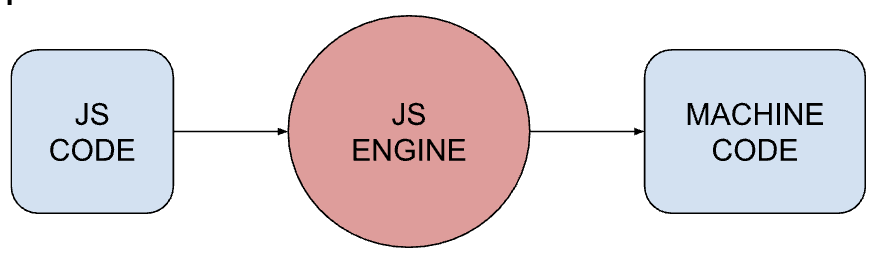

# Node Introduction

JavaScript is a programming language that was originally designed to run in web browsers, allowing developers to create interactive and dynamic web pages. So far we have been using Javascript to build applications inside our browser.

Every browser has a JS engine which converts Javascript code to code the computer can understand, remember that?

-   Safari uses JavaScriptCore
-   Firefox uses SpiderMonkey
-   Chrome uses V8
-   Edge uses Chakra
-   ...

Up to 2009, JavaScript could only be run in browsers. There was no way to run JavaScript code outside of a browser environment.

#### In 2009 Ryan Dahl created Node

Ryan used Google’ v8 JS engine (the fastest engine) and embedded it inside a C++ program and called it “Node”.

_Node is NOT a programming language! It is a runtime environment_

## Why Node?

Node allows developers to use JavaScript on both the client-side and server-side, enabling full-stack development with a single language.

## Difference between Client and Server

**Client application**
A client application is the software that runs on the user's device, such as a web browser or mobile app. It interacts with the user and communicates with a back-end service to fetch data or perform actions.

-   **Web app**: Runs in a web browser, like Google Chrome or Firefox.
-   **Mobile app**: Runs on a mobile device, like an iPhone or Android app.

**Server application**

A server application is a program that runs on a server and provides services to client applications. It processes requests from clients, performs operations, and sends responses back to the clients.

Some things you can't do in a browser:

-   Access the file system directly (e.g., read/write files)
-   Send emails
-   Push notifications

Why can't we do these things in the browser?

Because browsers are designed to be secure and protect users from malicious activities. Allowing direct access to the file system or sending emails could lead to security vulnerabilities.

**Back-end service / APIs**

Mostly used to build back-end services, also called APIs

-   API: Application Programmable Interface

These back-end services power the client applications, for example:

-   Web app
-   Mobile app

Examples of what back-end services do:

-   Store data (MySQL or another database)
-   Send mails
-   Push notificationsStore uploaded files
-   Store uploaded files
    

#### Client-Server Architecture

-   **Client**: The application that the user interacts with, such as a web or mobile app.
-   **Server**: The back-end service that processes requests from the client, performs operations like:
    -   Fetching data from a database
    -   Sending emails
    -   Storing files
-   **API**: The interface through which the client communicates with the server, allowing the client to request data or perform actions.

#### Metaphor

Imagine a restaurant with a waiter and a kitchen:

-   **Waiter**: Represents the Node server, taking orders (requests) from customers (clients).
-   **Kitchen**: Represents the back-end service that prepares meals (processes requests).
-   **Customers**: Represent the clients, who place orders (requests) through the waiter (Node server).

When a customer places an order, the waiter takes it to the kitchen and waits for the meal to be prepared. Once ready, the waiter serves it to the customer.

**Non-blocking / asynchronous**

Node by default is non-blocking.

-   _Synchronous_
    The waiter takes an order from Table 1 and waits in the kitchen until the chef finishes cooking the meal. Only then does the waiter return to serve Table 1 before taking the next order from Table 2. Everything happens in sequence, one at a time.
-   _Asynchronous_
    The waiter takes an order from Table 1 and immediately goes to take the order from Table 2 while the chef prepares the first meal. The waiter doesn't wait for the kitchen to finish before taking more orders. The kitchen notifies the waiter when each meal is ready, and the waiter serves them as they come out. Multiple tasks happen concurrently without blocking each other.

### So... why Node?

-   It’s easy to get started
-   You don’t have to learn a new programming language
-   The asynchronous nature of Node makes it highly scalable

## Node Architecture

_A runtime environment for executing Javascript code outside the browser_

So far we’ve been using Javascript to build applications inside our browser. A browser supplies a runtime environment for Javascript code. Every browser has a JS engine which converts Javascript code to code the computer can understand. For example

JS engines in different browsers:

-   Edge: Chakra
-   Firefox: SpiderMonkey
-   Chrome: v8

_Up to 2009 Javascript code could only be run in browsers_

#### In 2009 Ryan Dahl created Node

Ryan used Google’ v8 JS engine (the fastest engine) and embedded it inside a C++ program and called it “Node”.

#### Browser versus Node

Node provides certain object that are don't exist in the browser in the browser and visa versa.

For example, the document object (document.getElementById()) doesn’t exist in Node. There's no DOM (document object model) in available in Node, because it's not a browser.

Instead it provides other objects, some of which don't exist in the browser:

-   fs.readFile() - we can work with the file system
-   http.createServer() - we can listen for requests

## Install Node

First check if node is installed already:

-   Open command prompt (CMD on Windows, Terminal on Mac)
-   Run command: _node –version_
    -   If Node is already installed on your computer it should say something like `v20.03.00`

Install the latest version of Node:

-   Go to https://nodejs.org
-   Download Latest Stable version (LTS) of Node. On the homepage the latest stable version will be presented to you to download.
-   Execute the installer
    -   Agree with the terms
    -   Click "Next", "Next", etc, untill the install is finished
    -   Do not install any extra features that might be offered during the installation
-   Verify latest version is installed
    -   Run command: _node –version_

# Recap

-   Node is a runtime environment for executing JS code.
-   Up to 2009 Javascript could only be run in browsers
-   Node is a C++ program that embeds Chrome’s v8 engine.
-   Node is often used for back-end services
    -   database
    -   mail
    -   files
    -   push notifications
-   Node applications are asynchronous or non-blocking by default.
-   In Node, we don’t have browser environment objects such as window or the document object. Instead, we have other objects that are not available in browsers, such as objects for working with the:
    -   file system
    -   network
    -   operating system
