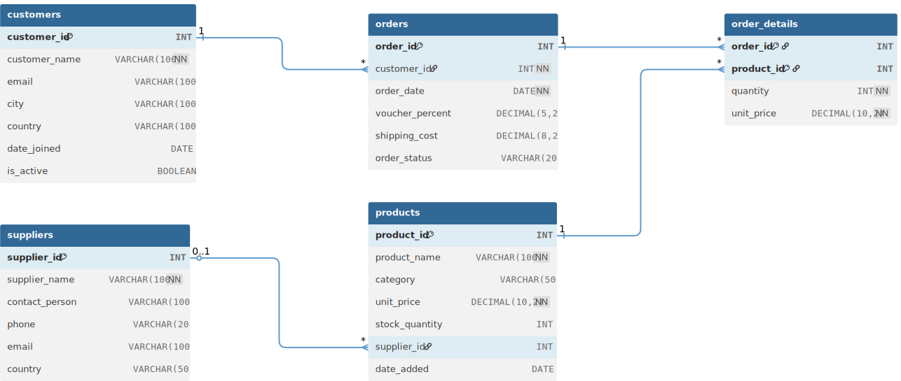

# Database Relationships and JOINs

## Before We Start

To follow along with all examples in this lesson, first run the setup file:
**[01-database-relationships/setup.sql](01-database-relationships/setup.sql)**

This creates a complete e-commerce database with customers, products, orders, suppliers, and order details tables - all properly related with foreign keys. The setup takes a bit longer as it creates realistic sample data for complex relationship practice.

Real-world applications rarely use just one table. Database relationships allow us to connect related information across multiple tables, avoiding data duplication and maintaining data integrity.

## Understanding Keys

### Primary Key (PK)

A Primary Key uniquely identifies each record in a table:

-   Must be unique for every row
-   Cannot be NULL (empty)
-   Usually an auto-incrementing number

```sql
CREATE TABLE customers (
    customer_id INT AUTO_INCREMENT PRIMARY KEY,  -- This is the Primary Key
    customer_name VARCHAR(100),
    city VARCHAR(100)
);
```

### Foreign Key (FK)

A Foreign Key creates a link between two tables by referencing the Primary Key of another table:

```sql
CREATE TABLE orders (
    order_id INT AUTO_INCREMENT PRIMARY KEY,
    order_date DATE,
    customer_id INT,                           -- This is a Foreign Key
    FOREIGN KEY (customer_id) REFERENCES customers(customer_id)
);
```

## Database Relationship Example

Let's build a simple e-commerce system with four related tables:

### 1. Customers Table

```sql
CREATE TABLE customers (
    customer_id INT AUTO_INCREMENT PRIMARY KEY,
    customer_name VARCHAR(100) NOT NULL,
    email VARCHAR(100) UNIQUE,
    city VARCHAR(100),
    country VARCHAR(100),
    date_joined DATE,
    is_active BOOLEAN DEFAULT TRUE
);
```

### 2. Supplier Table

```sql
CREATE TABLE suppliers (
    supplier_id INT AUTO_INCREMENT PRIMARY KEY,
    supplier_name VARCHAR(100) NOT NULL,
    contact_person VARCHAR(100),
    phone VARCHAR(20),
    email VARCHAR(100),
    country VARCHAR(50)
);
```

### 3. Products Table

```sql
CREATE TABLE products (
    product_id INT AUTO_INCREMENT PRIMARY KEY,
    supplier_id INT,
    product_name VARCHAR(100) NOT NULL,
    category VARCHAR(50),
    unit_price DECIMAL(10, 2) NOT NULL,
    stock_quantity INT DEFAULT 0,
    supplier_id INT,
    date_added DATE,
    FOREIGN KEY (supplier_id) REFERENCES suppliers(supplier_id)
);
```

### 4. Orders Table

```sql
CREATE TABLE orders (
    order_id INT AUTO_INCREMENT PRIMARY KEY,
    customer_id INT NOT NULL,
    order_date DATE NOT NULL,
    voucher_percent DECIMAL(5, 2) DEFAULT 0,
    shipping_cost DECIMAL(8, 2) DEFAULT 0,
    order_status VARCHAR(20) DEFAULT 'Pending',
    FOREIGN KEY (customer_id) REFERENCES customers(customer_id)
);
```

### 5. Order Details Table

```sql
CREATE TABLE order_details (
    order_id INT,
    product_id INT,
    quantity INT NOT NULL,
    unit_price DECIMAL(10, 2) NOT NULL,
    PRIMARY KEY (order_id, product_id),
    FOREIGN KEY (order_id) REFERENCES orders(order_id),
    FOREIGN KEY (product_id) REFERENCES products(product_id)
);
```

## Understanding the Relationships


<br><br>

-   One customer can have many orders
-   One order belongs to one customer
-   One order can have many order details (different products)
-   One product can appear in many order details
-   One product belongs to one supplier
-   One supplier can supply many products

## JOIN Operations

JOINs combine rows from multiple tables based on related columns.

### JOIN (INNER JOIN)

Returns only rows that have matching values in both tables:

```sql
-- Get orders with customer names
SELECT
    orders.order_id,
    customers.customer_name,
    orders.order_date
FROM orders
JOIN customers ON orders.customer_id = customers.customer_id;
```

### Using Table Aliases

Make queries cleaner with table aliases:

```sql
-- Same query with aliases
SELECT
    o.order_id,
    c.customer_name,
    o.order_date
FROM orders AS o
JOIN customers AS c ON o.customer_id = c.customer_id;
```

### Multiple Table JOINs

Join more than two tables:

```sql
-- Get order details with customer and product information
SELECT
    c.customer_name,
    p.product_name,
    od.quantity,
    od.unit_price,
    o.order_date
FROM order_details AS od
JOIN orders AS o ON od.order_id = o.order_id
JOIN customers AS c ON o.customer_id = c.customer_id
JOIN products AS p ON od.product_id = p.product_id;
```

## Practical JOIN Examples

### Example 1: Customer Order Summary

```sql
-- List all customers and their order count
SELECT
    c.customer_name,
    c.city,
    COUNT(o.order_id) AS 'Number of Orders'
FROM customers AS c
JOIN orders AS o ON c.customer_id = o.customer_id
GROUP BY c.customer_id, c.customer_name, c.city
ORDER BY COUNT(o.order_id) DESC;
```

### Example 2: Order Value Calculation

```sql
-- Calculate total value for each order
SELECT
    o.order_id,
    c.customer_name,
    o.order_date,
    SUM(od.quantity * od.unit_price) AS 'Order Total',
    o.voucher_percent AS 'Discount %',
    ROUND(SUM(od.quantity * od.unit_price) * (1 - o.voucher_percent / 100), 2) AS 'Final Total'
FROM orders AS o
JOIN customers AS c ON o.customer_id = c.customer_id
JOIN order_details AS od ON o.order_id = od.order_id
GROUP BY o.order_id, c.customer_name, o.order_date, o.voucher_percent
ORDER BY SUM(od.quantity * od.unit_price) DESC;
```

### Example 3: Product Popularity Analysis

```sql
-- Find most popular products
SELECT
    p.product_name,
    COUNT(od.order_id) AS 'Times Ordered',
    SUM(od.quantity) AS 'Total Quantity Sold',
    AVG(od.unit_price) AS 'Average Selling Price'
FROM products AS p
JOIN order_details AS od ON p.product_id = od.product_id
GROUP BY p.product_id, p.product_name
HAVING COUNT(od.order_id) >= 2
ORDER BY SUM(od.quantity) DESC;
```

### Example 4: Customer Analysis by Location

```sql
-- Sales analysis by country
SELECT
    c.country,
    COUNT(DISTINCT c.customer_id) AS 'Number of Customers',
    COUNT(o.order_id) AS 'Total Orders',
    ROUND(AVG(od.quantity * od.unit_price), 2) AS 'Average Order Line Value'
FROM customers AS c
JOIN orders AS o ON c.customer_id = o.customer_id
JOIN order_details AS od ON o.order_id = od.order_id
GROUP BY c.country
ORDER BY COUNT(o.order_id) DESC;
```

### Example 5: Product Category Performance

```sql
-- Find products over $200 ordered by customers in specific cities
SELECT DISTINCT
    p.product_name,
    p.unit_price,
    c.customer_name,
    c.city
FROM products AS p
JOIN order_details AS od ON p.product_id = od.product_id
JOIN orders AS o ON od.order_id = o.order_id
JOIN customers AS c ON o.customer_id = c.customer_id
WHERE p.unit_price > 200
    AND c.city IN ('Amsterdam', 'Rome', 'Berlin')
ORDER BY p.unit_price DESC;
```

## Advanced JOIN Concepts

### LEFT JOIN (LEFT OUTER JOIN)

Returns all rows from the left table, even if no match in the right table.

**Why use LEFT JOIN?** Imagine you're running a business and want to see ALL your customers - including those who haven't bought anything yet. A regular JOIN would only show customers who made purchases, but LEFT JOIN shows everyone. This is crucial for business reports like "customer engagement" or "marketing reach" where you need to see the full picture, including inactive customers.

**Real-world example**: You have 100 registered customers, but only 60 have placed orders. LEFT JOIN shows all 100 customers (with order counts of 0 for the 40 who haven't ordered), while regular JOIN would only show the 60 active customers.

```sql
-- Get all customers, including those who haven't placed orders
SELECT
    c.customer_name,
    COUNT(o.order_id) AS 'Order Count'
FROM customers AS c
LEFT JOIN orders AS o ON c.customer_id = o.customer_id
GROUP BY c.customer_id, c.customer_name;
```

### Self JOIN

Join a table to itself - this sounds weird at first, but it's incredibly useful!

**Why use Self JOIN?** Think of it like comparing people within your friend group. You want to find connections or similarities between records in the same table. Common uses include finding employees who work in the same department, students in the same class, or customers from the same city who might be interested in group discounts.

**Real-world example**: You're organizing a local meetup and want to connect customers who live in the same city so they can carpool together. Self JOIN lets you pair up customers from each city, creating a "buddy system" for your event.

```sql
-- Find customers from the same city (assuming we want to find pairs)
SELECT
    c1.customer_name AS 'Customer 1',
    c2.customer_name AS 'Customer 2',
    c1.city
FROM customers AS c1
JOIN customers AS c2 ON c1.city = c2.city
    AND c1.customer_id < c2.customer_id
ORDER BY c1.city;
```

## LIMIT with JOINs

LIMIT is crucial when working with JOINs as they can return very large result sets:

### Top Results from JOINs

```sql
-- Top 5 biggest orders by value
SELECT
    o.order_id,
    c.customer_name,
    SUM(od.quantity * od.unit_price) AS 'Order Total'
FROM orders AS o
JOIN customers AS c ON o.customer_id = c.customer_id
JOIN order_details AS od ON o.order_id = od.order_id
GROUP BY o.order_id, c.customer_name
ORDER BY SUM(od.quantity * od.unit_price) DESC
LIMIT 5;

-- Most recent 10 orders with customer details
SELECT
    o.order_id,
    c.customer_name,
    c.city,
    o.order_date
FROM orders AS o
JOIN customers AS c ON o.customer_id = c.customer_id
ORDER BY o.order_date DESC
LIMIT 10;
```

### Pagination with LIMIT and OFFSET

```sql
-- Get orders 11-20 (second page, 10 per page)
SELECT
    o.order_id,
    c.customer_name,
    o.order_date
FROM orders AS o
JOIN customers AS c ON o.customer_id = c.customer_id
ORDER BY o.order_date DESC
LIMIT 10 OFFSET 10;
```

## Best Practices

### 1. Always Use Table Aliases

```sql
-- Good
SELECT c.customer_name, o.order_date
FROM customers AS c
INNER JOIN orders AS o ON c.customer_id = o.customer_id;

-- Avoid (gets confusing with multiple tables)
SELECT customer_name, order_date
FROM customers
JOIN orders ON customers.customer_id = orders.customer_id;
```

### 2. Be Specific with Column Selection

```sql
-- Good - specify exactly what you need
SELECT c.customer_name, o.order_date, od.quantity
FROM customers AS c...

-- Avoid - can return too much data
SELECT *
FROM customers AS c...
```

### 3. Use Meaningful Aliases

```sql
-- Good
SELECT
    c.customer_name AS 'Customer Name',
    COUNT(o.order_id) AS 'Total Orders'
FROM customers AS c...

-- Less clear
SELECT
    c.customer_name AS name,
    COUNT(o.order_id) AS cnt
FROM customers AS c...
```

## Practice Exercises

### Basic JOINs

1. List all orders with customer names and cities
2. Show all products that have been ordered, with order dates
3. Find customers who have placed orders, with their total order count

### Intermediate Analysis

4. Calculate the total revenue generated by each customer
5. Find the most expensive single order line (quantity × price)
6. List products that have never been ordered (hint: use LEFT JOIN)

### Advanced Queries

7. Find customers who have ordered products worth more than $500 in total
8. Calculate monthly sales totals
9. Find the average order value per country
10. Identify customers who have ordered the same product multiple times

### Business Intelligence

11. Create a report showing each customer's favorite product (most frequently ordered)
12. Find products that are popular in specific countries
13. Calculate customer lifetime value (total amount spent per customer)
14. Identify seasonal trends (if you have enough date range in your data)

## Partice Yourself Exercises

Follow the instructions for the remaining exercises as outlined in the file:

-   **[01-database-relationships/exercises.sql](01-database-relationships/exercises.sql)**: Progressive JOIN exercises from basic to business intelligence
-   **[01-database-relationships/solutions.sql](01-database-relationships/solutions.sql)**: Complete solutions with complex business queries

## Database Structure Created

The setup creates these related tables:

-   **customers**: Customer information with geographic data
-   **products**: Product catalog with suppliers and categories
-   **orders**: Order transactions with discounts and shipping
-   **order_details**: Individual items within orders
-   **suppliers**: Product supplier information

## Common JOIN Mistakes

1. **Missing JOIN condition**: Results in a Cartesian product (every row matched with every row)
2. **Wrong JOIN type**: Using JOIN when you need LEFT JOIN (or vice versa)
3. **Ambiguous column names**: Not specifying which table a column comes from
4. **Forgetting GROUP BY**: When using aggregate functions with JOINs

## Next Steps

You now understand the fundamentals of SQL! Practice these concepts with the provided setup files and exercises. The key to mastering SQL is practice with real data scenarios.

Continue practicing with the comprehensive exercise files in each lesson folder.
