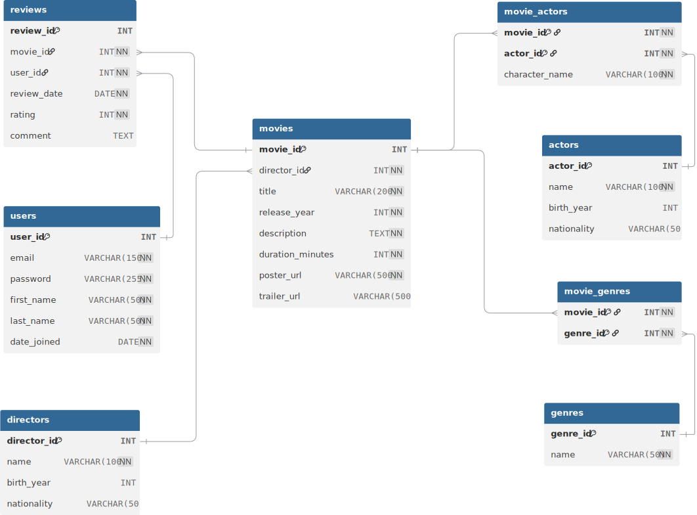

# Homework: MySQL Integration with Node.js

## Setup project structure:

Create a new project called `movie-website-v5`, and create 2 subfolders:

-   `server`
    -   add `index.js` file
    -   add `package.json` file (`npm init -y`)
-   `public`
    -   add `index.html` file
    -   add `styles.css` file
    -   add `app.js` file

### Setup database:

Create the movie database using the provided SQL files:

-   [schema.sql](../2025-08-22/03-weekend-assigment/schema.sql)
-   [sample_data.sql](../2025-08-22/03-weekend-assigment/sample_data.sql)

These files will create a teh following tables and populate it with sample data.


<br><Br>

Here are some sample queries you can run to test your database:

-   [queries.sql](../2025-08-22/03-weekend-assigment/queries.sql)

## Task 1 - Node Setup

Setup your Node.js server:

-   use the express package
-   use the cors package
-   use the mysql2 package
-   create a server that listens on port 3000
-   create a database connection using the mysql2 package

**Hint 1:** you need to install 3 NPM packages:

-   `express`
-   `cors`
-   `mysql2`

**Hint 2:** Here is a sample code to get you started:

```javascript
// Server
const express = require("express");
const cors = require("cors");
const app = express();
const port = 3000;
app.use(cors());

// Database connection
const mysql = require("mysql2/promise");
const db = mysql.createPool({
    host: "localhost",
    user: "root",
    password: "",
    database: "bootcamp-movies",
    port: 3306,
    waitForConnections: true,
    connectionLimit: 10,
    queueLimit: 0,
    namedPlaceholders: true,
});
/*
 *   ↑↑↑ DO NOT change the code above this comment
 *   =============================================
 *   ↓↓↓ ADD your code below this comment
 */

app.get("/", (req, res) => {
    res.send("Hello World!");
});

/*
 *   ↑↑↑ ADD your code above this comment
 *   =============================================
 *   ↓↓↓ DO NOT change the code below this comment
 */
app.listen(port, () => {
    console.log(`Server app listening at http://localhost:${port}`);
});
```

## Task 2 - Movies Route

Create a route `/movies` that returns all movies from the `movies` table in JSON format. Get the following columns from the database:

-   movies movie_id
-   movies title
-   movies release_year
-   movies duration_minutes
-   movies description
-   directors name (join with directors table)

**Hint:**

-   You need to use the database connection to fetch the data from the `movies` table.
-   You need to use the `db.query` method to execute a SQL query.
-   You need to return the data in JSON format using `res.json` method.
-   Example codes can be found in [the mysql2 documentation](./05-mysql2-package.md).

**Test:** You can test your route by opening the following URL in your browser: `http://localhost:3000/movies`. You should see a JSON array of movies.

## Task 3 - Frontend Integration

In the `public` folder, add a `fetch` request to the `/movies` route and display simple movies cards in the `index.html` file.

-   Movie Title
-   Movie Release Year
-   Movie Duration in Minutes
-   Movie desciption
-   Director Name
-   Example codes for fetching data can be found in [the Fetch API documentation](../2025-08-15/03-putting-it-all-together.md#step-3-fetch-data-from-the-server).

---

## Steps to successfully complete the homework:

1. Setup the database using the provided SQL files.
2. Setup the Node.js server with Express, CORS, and MySQL2 packages.
3. Make sure your server is running and listening on port 3000.
4. Take some time to understand the database schema and the relationships between tables.
5. Write he SQL query to fetch all movies from the `movies` table in TablePlus or any MySQL client and verify you're getting the expected results.
6. Implement the `/movies` route in your Express server to fetch and return the movies in JSON format.
7. Test the `/movies` route by accessing it in your browser or using a `http://localhost:3000/movies` URL.
8. In the `public` folder, implement the frontend code to fetch the movies from the `/movies` route and display them in the `index.html` file.
9. Style the movie cards using CSS in the `styles.css` file.
10. Test the entire application by running the server and opening the `index.html` file in your browser to see the list of movies displayed.
