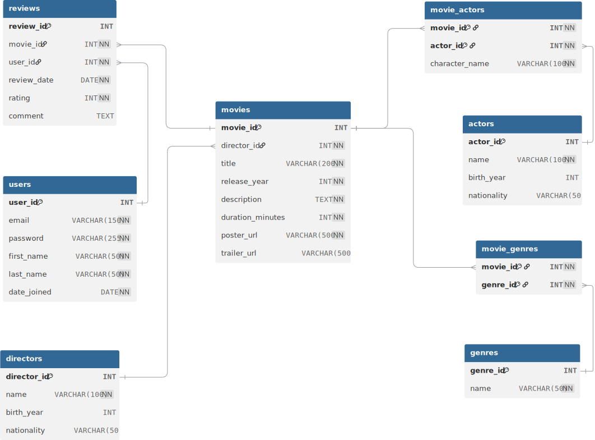

# Practice: Movie Website with Node.js and MySQL

## Folder Structure

Create a new project called `movie-website-v5`, and create 2 subfolders:

-   `server/`
-   `public/`

## Database Setup:

Create the movie database using the provided SQL files:

-   [schema.sql](../2025-08-22/03-weekend-assigment/schema.sql)
-   [sample_data.sql](../2025-08-22/03-weekend-assigment/sample_data.sql)

These files will create a teh following tables and populate it with sample data.


<br><Br>

Here are some sample queries you can run to test your database:

-   [queries.sql](../2025-08-22/03-weekend-assigment/queries.sql)

---

# Node Setup

## Task 1 - Initial Setup

Inside the `server/` folder, create do the following:

-   Create a file called `index.js`
-   Create our `package.json` file.
    -   You can do this by running `npm init -y` in the terminal
    -   Make sure you are in the `server/` folder when you run this command
-   Install the following NPM packages:
    -   `express`
    -   `cors`
    -   `mysql2`

## Task 2 - Build & Run the Server

Setup your Node.js server:

-   use the express package
-   use the cors package
-   create a server that listens on port 3000
-   Start your server by running `node --watch index.js` in the terminal

Here is the Node.js server starter template code:

```javascript
// Server
const express = require("express");
const cors = require("cors");
const app = express();
const port = 3000;
app.use(cors());

/*
 *   ↑↑↑ DO NOT change the code above this comment
 *   =============================================
 *   ↓↓↓ ADD your code below this comment
 */

app.get("/", (req, res) => {
    res.send("Hello World!");
});

/*
 *   ↑↑↑ ADD your code above this comment
 *   =============================================
 *   ↓↓↓ DO NOT change the code below this comment
 */
app.listen(port, () => {
    console.log(`Server app listening at http://localhost:${port}`);
});
```

## Task 3 - Database Connection

-   Create a database connection using the `mysql2` package.
-   Use the `createPool` method to create a connection pool.
-   Use the following connection details:
    -   host: "localhost"
    -   user: "your_username"
    -   password: "your_password"
    -   database: "your_database_name"
-   Run a simple query to test the connection.

```javascript
const mysql = require("mysql2/promise");

const db = mysql.createPool({
    host: "localhost",
    user: "your_user",
    password: "your_password",
    database: "your_databqse",
});
```

---

# Frontend Setup

## Task 1 - Initial Setup

-   Inside the `public/` folder, create the following files:
    -   `index.html`
    -   `genre.html`
    -   `movie.html`
    -   `styles.css`
    -   `app.js`

## Task 2 - HTML boilerplate & Navigation Menu

-   Add the HTML boilerplate to both `index.html` and `movies.html`.
-   Add a navigation menu to both `index.html`, `genre.html` and `movies.html` that links to both pages.

```html
<!DOCTYPE html>
<html lang="en">
    <head>
        <meta charset="UTF-8" />
        <meta name="viewport" content="width=device-width, initial-scale=1.0" />
        <link rel="stylesheet" href="styles.css" />
        <title>Movie Website</title>
    </head>
    <body>
        <!-- Navigation Menu -->
        <nav>
            <ul>
                <li><a href="index.html">Home</a></li>
            </ul>
        </nav>

        <!-- Load app.js -->
        <script src="app.js"></script>
    </body>
</html>
```

-   Update the page title in both `index.html`, `genre.html` and `movies.html` to reflect the page content.

---

# Navigation Menu

We want to add the different movie genres to the navigation menu. Each genre should link to the `genre.html` page with a query parameter for the genre ID.

`<li><a href="genre.html?genre_id=1">Action</a></li>`

## Task 1 - Create a Genres Route in the Server

-   Create a route `/genres` that returns all genres from the `genres` table in JSON format.
-   Get the following columns from the database:
    -   genres genre_id
    -   genres name
-   Order the genres by name alphabetically (A-Z) while querying the database.
-   Return the data in JSON format using `res.json` method.
-   Test your route by opening the following URL in your browser: `http://localhost:3000/genres`. You should see a JSON array of genres.

## Task 2 - Fetch Genres in the Frontend

We want to fetch the genres from the server and display them in the navigation menu. We need to do this for all our pages: `index.html`, `genre.html` and `movies.html`.

Since we want to do this on multiple pages, it's best to put the code in `app.js`.

**Thought Process:**

-   Are we going to put the code in a function?
    -   Yes!... Why?
        -   We can call the function on multiple pages
        -   We can reuse the code
-   What should we name the function?
    -   `fetchAndDisplayGenres()` for example. It describes what the function does.
-   What should the function do?
    -   Fetch the genres from the server
    -   Add the genre links to the navigation menu
-   How do we add the genre links to the navigation menu?
    -   We can use `document.getElementById()` to get the navigation menu element
        -   Make sure to add an `id` attribute to the `<ul>` element in the navigation menu. For example: `<ul id="nav-menu">`
    -   We can use `innerHTML` to add the genre links to the navigation menu
-   When should we call the function?
    -   We should call the function when the page loads
    -   We should add a `<script>` tag at the end of the `body` tag and call the function there.

**Work out what we just discussed above.**

-   Create a function `fetchAndDisplayGenres()` in `app.js`
-   Use the Fetch API to fetch the genres from the server
    -   [Checkout this eample to get you started](../2025-08-15/03-putting-it-all-together.md#step-3-fetch-data-from-the-server).
-   Test if we fo get back the genres in the browser console.
-   Get the navigation menu element using `document.getElementById()`
-   Loop through the genres and create a list item for each genre
    -   Add the list items to the navigation menu using `innerHTML`
    -   Something like `<li><a href="genre.html?genre_id=1">Action</a></li>`

---

# Genre Page

Now that we have the genres in the navigation menu, we want to display the movies for each genre on the `genre.html` page.

## Task 1 - Create a Dynamic Route to Fetch Movies by Genre

-   Create a route `/genre/:genre_id` that returns all movies for a specific genre from the `movies` table in JSON format.
-   Get the following columns from the database:
    -   movies movie_id
    -   movies title
    -   movies release_year
    -   movies duration_minutes
    -   movies description
    -   directors name (join with directors table)
-   Filter the movies by genre_id while querying the database.
-   Order the movies by release_year in descending order (newest to oldest) while querying the database.
-   Return the data in JSON format using `res.json` method.
-   Test your route by opening the following URL in your browser: `http://localhost:3000/genre/1`. You should see a JSON array of movies for the genre with ID 1.

## Task 2 - Frontend Integration

We want to fetch the movies for a specific genre from the server and display them on the `genre.html` page. But how do we know which genre to fetch?

Our navigation menu links to the `genre.html` page with a **query parameter** for the genre ID. For example: `genre.html?genre_id=1`.

_How again do we get the query parameter from the URL?_

```javascript
// A bit shorter version for getting query parameters
const urlParams = new URLSearchParams(window.location.search);
const genreId = urlParams.get("genre_id");
```

Once we have the `genreId`, we can use it to fetch the movies for that genre from the server by sending a request to the `/genre/:genre_id` route.

**Thought Process:**

-   Are we going to put the code in a function?
    -   Yes!... Why?
        -   We actually don't have to, but it's a good practice to keep our code organized. Maybe we want to reuse the code later. For example on the homwe page to show the 2 latest movies of each genre.
-   What should we name the function?
    -   `fetchAndDisplayMoviesByGenre()` for example. It describes what the function does.
-   What should the function do?
    -   Get the genre ID from the URL query parameter
    -   Fetch the movies for that genre from the server
    -   Display the movies on the page
-   How do we display the movies on the page?
    -   We can create a container element in the `genre.html` file to hold the movie cards
    -   We can use `document.getElementById()` to get the container element
        -   Make sure to add an `id` attribute to the container element. For example: `<div id="movies-container"></div>`
    -   We can use `innerHTML` to add the movie cards to the container
-   When should we call the function?
    -   We should call the function when the page loads
    -   We should add a `<script>` tag at the end of the `body` tag and call the function there.

**Work out what we just discussed above.**

-   Create a function `fetchAndDisplayMoviesByGenre()` in `app.js`
-   Get the genre ID from the URL query parameter
-   Use the Fetch API to fetch the movies for that genre from the server
    -   [Checkout this eample to get you started](../2025-08-15/03-putting-it-all-together.md#step-3-fetch-data-from-the-server).
-   Test if we do get back the movies in the browser console.
-   Get the container element using `document.getElementById()`
-   Loop through the movies and create a card for each movie
    -   Add the movie cards to the container using `innerHTML`

---

# Rating info

At the moment we show the following info for each movie:

-   Title
-   Release Year
-   Duration (in minutes)
-   Description
-   Director name

We want to add the average rating and the number of ratings for each movie.

## Task 1 - Update the Database Query

-   Update the `/genre/:genre_id` route to include the average rating and the number of ratings for each movie.

**Thought Process:**

To get the average rating and the number of ratings, we need to collect that data from the `reviews` table.

We can do this by joining the `reviews` table with the `movies` table on the `movie_id` column.

Do we need to use GROUP BY?

-   Yes, because we want to group the reviews by movie and calculate the average rating and the number of ratings for each movie.
-   [Checkout this document for help](../2025-08-21/03-aggregate-functions.md)
    -   You will need to use the `AVG()`, `SUM()` and `COUNT()` aggregate functions.
    -   You will need to join the `ratings` table to get the ratings for each movie.

**Work out what we just discussed above.**

-   Update the SQL query in the `/genre/:genre_id` route to include the average rating and the number of ratings for each movie.
    -   Before changing the query in your server script, you can test the query in a MySQL client like TablePlus, SQL Fiddle, or any other MySQL client you prefer.
-   Once you have the query working, update the server script to use the new query.
-   Test the route by opening the following URL in your browser: `http://localhost:3000/genre/1`. You should see a JSON array of movies for the genre with ID 1, including the average rating and the number of ratings for each movie.

## Task 2 - Frontend Integration

-   Update the `fetchAndDisplayMoviesByGenre()` function in `app.js` to display the average rating and the number of ratings for each movie.
