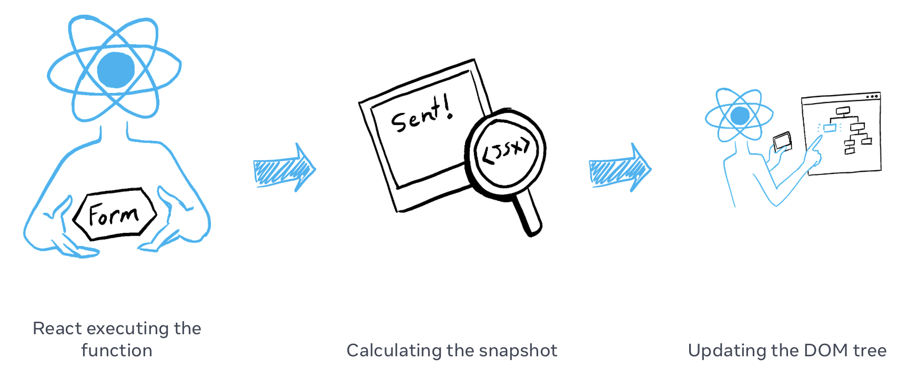

# React

> This document **_doesn't_** use any TypeScript in the code examples. It's focus is on React related subjects only.
>
> **Checkout the [TypeScript document](./typescript.md)** for more information on TypeScript!

-   [Introduction](#introduction)
    -   [Write components with code and markup](#write-components-with-code-and-markup)
    -   [Add interactivity wherever you need it](#add-interactivity-wherever-you-need-it)
-   [JSX](#jsx)
    -   [Putting markup into JavaScript](#putting-markup-into-javascript)
    -   [Converting HTML to JSX](#converting-html-to-jsx)
    -   [The Rules of JSX](#the-rules-of-jsx)
        -   [1. Return a single root element](#1-return-a-single-root-element)
        -   [2. Close all the tags](#2-close-all-the-tags)
        -   [3. camelCase most of the things!](#3-camelcase-most-of-the-things)
    -   [JavaScript in JSX with Curly Braces](#javascript-in-jsx-with-curly-braces)
        -   [Passing strings with quotes](#passing-strings-with-quotes)
        -   [Using curly braces: A window into the JavaScript world](#using-curly-braces-a-window-into-the-javascript-world)
        -   [Using “double curlies”: CSS and other objects in JSX](#using-double-curlies-css-and-other-objects-in-jsx)
        -   [More fun with JavaScript objects and curly braces](#more-fun-with-javascript-objects-and-curly-braces)
-   [Components](#components)
    -   [Defining a component](#defining-a-component)
        -   [Export the component](#step-1-export-the-component)
        -   [Define the function](#step-2-define-the-function)
        -   [Add markup](#step-3-add-markup)
    -   [Using a component](#using-a-component)
    -   [What the browser sees](#what-the-browser-sees)
    -   [Nesting and organizing components](#nesting-and-organizing-components)
    -   [Importing and Exporting component](#importing-and-exporting-component)
        -   [The root component file](#the-root-component-file)
        -   [Exporting and importing a component](#exporting-and-importing-a-component)
-   [Props](#props)
    -   [Familiar props](#familiar-props)
    -   [Passing props to a component](#passing-props-to-a-component)
        -   [Pass props to the child component](#step-1-pass-props-to-the-child-component)
        -   [Read props inside the child component](#step-2-read-props-inside-the-child-component)
-   [useState](#usestate)
    -   [Setting state triggers renders](#setting-state-triggers-renders)
    -   [State over time](#state-over-time)
    -   [State updater function](#state-updater-function)
        -   [React batches state updates](#react-batches-state-updates)
        -   [Updating the same state multiple times before the next render](#updating-the-same-state-multiple-times-before-the-next-render)
        -   [What happens if you update state after replacing it](#what-happens-if-you-update-state-after-replacing-it)
        -   [What happens if you replace state after updating it](#what-happens-if-you-replace-state-after-updating-it)
        -   [Naming conventions](#naming-conventions)
        -   [Recap](#recap)
-   [TypeScript & JSX](#typescript)

---

## Introduction

React lets you build user interfaces out of individual pieces called components. Create your own React components like Thumbnail, LikeButton, and Video. Then combine them into entire screens, pages, and apps.

### Write components with code and markup

React components are JavaScript functions. You could say the basic structure of a component is divided in two parts: normal Javascript code and JSX markup, a combination of HTML and JS:

```jsx
function VideoList({ videos, emptyHeading }) {

    // Javascript

    return (

        // JSX markup

    );
}
```

Want to show some content conditionally? Use an `if` statement. Displaying a list? Try array `map()`. Learning React is learning programming.

```jsx
function VideoList({ videos, emptyHeading }) {
    // Javascript
    const count = videos.length;
    let heading = emptyHeading;
    if (count > 0) {
        const noun = count > 1 ? "Videos" : "Video";
        heading = count + " " + noun;
    }

    // JSX markup
    return (
        <section>
            <h2>{heading}</h2>
            {videos.map((video) => (
                <Video key={video.id} video={video} />
            ))}
        </section>
    );
}
```

This markup syntax is called JSX. It is a JavaScript syntax extension popularized by React. Putting JSX markup close to related rendering logic makes React components easy to create, maintain, and delete.

### Add interactivity wherever you need it

React components receive data and return what should appear on the screen. You can pass them new data in response to an interaction, like when the user types into an input. React will then update the screen to match the new data.

```jsx
import { useState } from "react";

function SearchableVideoList({ videos }) {
    // Javascript
    const [searchText, setSearchText] = useState("");
    const foundVideos = filterVideos(videos, searchText);

    // JSX markup
    return (
        <>
            <SearchInput
                value={searchText}
                onChange={(newText) => setSearchText(newText)}
            />
            <VideoList
                videos={foundVideos}
                emptyHeading={`No matches for “${searchText}”`}
            />
        </>
    );
}
```

You don’t have to build your whole page in React. Add React to your existing HTML page, and render interactive React components anywhere on it.

---

## JSX

JSX is a syntax extension for JavaScript that lets you write HTML-like markup inside a JavaScript file. Although there are other ways to write components, most React developers prefer the conciseness of JSX, and most codebases use it.

### Putting markup into JavaScript

The Web has been built on HTML, CSS, and JavaScript. For many years, web developers kept content in HTML, design in CSS, and logic in JavaScript—often in separate files! Content was marked up inside HTML while the page’s logic lived separately in JavaScript:


But as the Web became more interactive, logic increasingly determined content. JavaScript was in charge of the HTML! This is why in **React, rendering logic and markup live together in the same place—components.**


Keeping a button’s rendering logic and markup together ensures that they stay in sync with each other on every edit. Conversely, details that are unrelated, such as the button’s markup and a sidebar’s markup, are isolated from each other, making it safer to change either of them on their own.

_Each React component is a JavaScript function that may contain some markup that React renders into the browser. React components use a syntax extension called JSX to represent that markup. JSX looks a lot like HTML, but it is a bit stricter and can display dynamic information. The best way to understand this is to convert some HTML markup to JSX markup._

> JSX and React are two separate things. They’re often used together, but you can use them independently of each other. JSX is a syntax extension, while React is a JavaScript library.

### Converting HTML to JSX

Suppose that you have some (perfectly valid) HTML:

```html
<h1>Hedy Lamarr's Todos</h1>

<ul>
    <li>Invent new traffic lights</li>
    <li>Rehearse a movie scene</li>
    <li>Improve the spectrum technology</li>
</ul>
```

And you want to put it into your component:

```jsx
export default function TodoList() {
    return (
        // ???
    )
}
```

If you copy and paste it as is, it will not work:

```jsx
export default function TodoList() {
    return (
        // This doesn't quite work!
        <h1>Hedy Lamarr's Todos</h1>
        
        <ul>
            <li>Invent new traffic lights
            <li>Rehearse a movie scene
            <li>Improve the spectrum technology
        </ul>
    );
}
```

```js
Error

/src/App.js: Adjacent JSX elements must be wrapped in an enclosing tag. Did you want a JSX fragment <>...</>? (5:4)

  3 |     // This doesn't quite work!
  4 |     <h1>Hedy Lamarr's Todos</h1>
> 5 |     `:

```html
<div>
    <h1>Hedy Lamarr's Todos</h1>
    
    <ul>
        ...
    </ul>
</div>
```

If you don’t want to add an extra `<div>` to your markup, you can write `<>` and `</>` instead:

```html
<>
    <h1>Hedy Lamarr's Todos</h1>
    
    <ul>
        ...
    </ul>
</>
```

This empty tag is called a **Fragment**. Fragments let you group things without leaving any trace in the browser HTML tree.

#### 2. Close all the tags

JSX requires tags to be explicitly closed: self-closing tags like `` must become ``, and wrapping tags like `<li>oranges` must be written as `<li>oranges</li>`.

```html
<>
    
    <ul>
        <li>Invent new traffic lights</li>
        <li>Rehearse a movie scene</li>
        <li>Improve the spectrum technology</li>
    </ul>
</>
```

#### 3. camelCase most of the things!

JSX turns into JavaScript and attributes written in JSX become keys of JavaScript objects. In your own components, you will often want to read those attributes into variables. But JavaScript has limitations on variable names. For example, their names can’t contain dashes or be reserved words like `class`.

This is why, in React, many HTML and SVG attributes are written in camelCase. For example, instead of `stroke-width` you use `strokeWidth`. Since class is a reserved word, in React you write `className` instead, named after the [corresponding DOM property](https://developer.mozilla.org/en-US/docs/Web/API/Element/className):

```html

```

You can [find all these attributes in the list of DOM component props.](https://react.dev/reference/react-dom/components/common) If you get one wrong, don’t worry—React will print a message with a possible correction to the browser console.

### JavaScript in JSX with Curly Braces

JSX lets you write HTML-like markup inside a JavaScript file, keeping rendering logic and content in the same place. Sometimes you will want to add a little JavaScript logic or reference a dynamic property inside that markup. In this situation, you can use curly braces in your JSX to open a window to JavaScript.

#### Passing strings with quotes

When you want to pass a string attribute to JSX, you put it in single or double quotes:

```jsx
export default function Avatar() {
    return (
        
    );
}
```

Here, `"https://i.imgur.com/7vQD0fPs.jpg"` and `"Gregorio Y. Zara"` are being passed as strings.

But what if you want to dynamically specify the `src` or `alt` text? You could **use a value from JavaScript by replacing `"`" and `"`" with `{` and `}`**:

```jsx
export default function Avatar() {
    const avatar = "https://i.imgur.com/7vQD0fPs.jpg";
    const description = "Gregorio Y. Zara";
    return ;
}
```

Notice the difference between `className="avatar"`, which specifies an `"avatar"` CSS class name that makes the image round, and `src={avatar}` that reads the value of the JavaScript variable called `avatar`. That’s because curly braces let you work with JavaScript right there in your markup!

#### Using curly braces: A window into the JavaScript world

JSX is a special way of writing JavaScript. That means it’s possible to use JavaScript inside it—with curly braces `{ }`. The example below first declares a name for the scientist, `name`, then embeds it with curly braces inside the `<h1>`:

```jsx
export default function TodoList() {
    const name = "Gregorio Y. Zara";
    return <h1>{name}'s To Do List</h1>;
}
```

Try changing the `name’s` value from `'Gregorio Y. Zara'` to `'Hedy Lamarr'`. See how the list title changes?

Any JavaScript expression will work between curly braces, including function calls like f`ormatDate()`:

```jsx
const today = new Date();

function formatDate(date) {
    return new Intl.DateTimeFormat("en-US", { weekday: "long" }).format(date);
}

export default function TodoList() {
    return <h1>To Do List for {formatDate(today)}</h1>;
}
```

##### Where to use curly braces

You can only use curly braces in two ways inside JSX:

1. **As text** directly inside a JSX tag: `<h1>{name}'s To Do List</h1>` works, but `<{tag}>Gregorio Y. Zara's To Do List</{tag}>` will not.
2. **As attributes** immediately following the `=` sign: `src={avatar}` will read the `avatar` variable, but `src="{avatar}"` will pass the string `"{avatar}"`.

#### Using “double curlies”: CSS and other objects in JSX

In addition to strings, numbers, and other JavaScript expressions, you can even pass objects in JSX. Objects are also denoted with curly braces, like `{ name: "Hedy Lamarr", inventions: 5 }`. Therefore, to pass a JS object in JSX, you must wrap the object in another pair of curly braces: `person={{ name: "Hedy Lamarr", inventions: 5 }}`.

You may see this with inline CSS styles in JSX. React does not require you to use inline styles (CSS classes work great for most cases). But when you need an inline `style`, you pass an object to the style attribute:

```jsx
export default function TodoList() {
    return (
        <ul
            style={{
                backgroundColor: "black",
                color: "pink",
            }}
        >
            <li>Improve the videophone</li>
            <li>Prepare aeronautics lectures</li>
            <li>Work on the alcohol-fuelled engine</li>
        </ul>
    );
}
```

Try changing the values of `backgroundColor` and `color`.

You can really see the JavaScript object inside the curly braces when you write it like this:

```jsx
<ul style={
    {
        backgroundColor: 'black',
        color: 'pink'
    }
}>
```

The next time you see `{{` and `}}` in JSX, know that it’s nothing more than an object inside the JSX curlies!

#### More fun with JavaScript objects and curly braces

You can move several expressions into one object, and reference them in your JSX inside curly braces:

```jsx
const person = {
    name: "Gregorio Y. Zara",
    theme: {
        backgroundColor: "black",
        color: "pink",
    },
};

export default function TodoList() {
    return (
        <div style={person.theme}>
            <h1>{person.name}'s Todos</h1>
            
            <ul>
                <li>Improve the videophone</li>
                <li>Prepare aeronautics lectures</li>
                <li>Work on the alcohol-fuelled engine</li>
            </ul>
        </div>
    );
}
```

In this example, the `person` JavaScript object contains a `name` string and a `theme` object:

```js
const person = {
    name: "Gregorio Y. Zara",
    theme: {
        backgroundColor: "black",
        color: "pink",
    },
};
```

The component can use these values from person like so:

```jsx
<div style={person.theme}>
    <h1>{person.name}'s Todos</h1>
```

JSX is very minimal as a templating language because it lets you organize data and logic using JavaScript.

---

## Components

On the Web, HTML lets us create rich structured documents with its built-in set of tags like `<h1>` and `<li>`:

```html
<article>
    <h1>My First Component</h1>
    <ol>
        <li>Components: UI Building Blocks</li>
        <li>Defining a Component</li>
        <li>Using a Component</li>
    </ol>
</article>
```

This markup represents this article `<article>`, its heading `<h1>`, and an (abbreviated) table of contents as an ordered list `<ol>`. Markup like this, combined with CSS for style, and JavaScript for interactivity, lies behind every sidebar, avatar, modal, dropdown—every piece of UI you see on the Web.

React lets you combine your markup, CSS, and JavaScript into custom “components”, reusable UI elements for your app. The table of contents code you saw above could be turned into a `<TableOfContents />` component you could render on every page. Under the hood, it still uses the same HTML tags like `<article>`, `<h1>`, etc.

Just like with HTML tags, you can compose, order and nest components to design whole pages. For example, the documentation page you’re reading is made out of React components:

```jsx
<PageLayout>
    <NavigationHeader>
        <SearchBar />
        <Link to="/docs">Docs</Link>
    </NavigationHeader>
    <Sidebar />
    <PageContent>
        <TableOfContents />
        <DocumentationText />
    </PageContent>
</PageLayout>
```

### Defining a component

A React component is a JavaScript function that you can sprinkle with markup. Here’s what that looks like:

```jsx
// App.js
export default function Profile() {
    return (
        
    );
}
```

And here’s how to build a component:

#### Step 1: Export the component

The `export default `prefix is a [standard JavaScript syntax](https://developer.mozilla.org/docs/web/javascript/reference/statements/export) (not specific to React). It lets you mark the main function in a file so that you can later import it from other files.

#### Step 2: Define the function

With function `Profile() { }` you define a JavaScript function with the name `Profile`.

> React components are regular JavaScript functions, but their names must start with a capital letter or they won’t work!

#### Step 3: Add markup

The component returns an `` tag with src and alt attributes. `` is written like HTML, but it is actually JavaScript under the hood! This syntax is called [JSX](https://react.dev/learn/writing-markup-with-jsx), and it lets you embed markup inside JavaScript.

Return statements can be written all on one line, as in this component:

```jsx
return ;
```

But if your markup isn’t all on the same line as the return keyword, you must wrap it in a pair of parentheses:

```jsx
return (
    <div>
        
    </div>
);
```

> Without parentheses, any code on the lines after return will be ignored!

### Using a component

Now that you’ve defined your `Profile` component, you can nest it inside other components. For example, you can export a `Gallery` component that uses multiple `Profile` components:

```jsx
// App.js
function Profile() {
    return (
        
    );
}

export default function Gallery() {
    return (
        <section>
            <h1>Amazing scientists</h1>
            <Profile />
            <Profile />
            <Profile />
        </section>
    );
}
```

### What the browser sees

Notice the difference in casing:

`<section>` is lowercase, so React knows we refer to an HTML tag.
`<Profile />` starts with a capital `P`, so React knows that we want to use our component called `Profile`.

And `Profile` contains even more HTML: ``. In the end, this is what the browser sees:

```html
<section>
    <h1>Amazing scientists</h1>
    
    
    
</section>
```

### Nesting and organizing components

Components are regular JavaScript functions, so you can keep multiple components in the same file. This is convenient when components are relatively small or tightly related to each other. If this file gets crowded, you can always move `Profile` to a separate file. More about this soon.

Because the `Profile` components are rendered inside `Gallery` — even several times! — we can say that `Gallery` is a **parent component**, rendering each `Profile` as a “child”. This is part of the magic of React: you can define a component once, and then use it in as many places and as many times as you like.

> Components can render other components, but you must never nest their definitions:

```js
export default function Gallery() {
    // 🔴 Never define a component inside another component!
    function Profile() {
        // ...
    }
    // ...
}
```

> The snippet above is very slow and causes bugs. Instead, define every component at the top level:

```js
export default function Gallery() {
    // ...
}

// ✅ Declare components at the top level
function Profile() {
    // ...
}
```

> When a child component needs some data from a parent, pass it by props instead of nesting definitions.

### Importing and Exporting component

The magic of components lies in their reusability: you can create components that are composed of other components. But as you nest more and more components, it often makes sense to start splitting them into different files. This lets you keep your files easy to scan and reuse components in more places.

#### The root component file

Earlier, we made a `Profile` component and a `Gallery` component that renders it:

```jsx
// App.js
function Profile() {
    return (
        
    );
}

export default function Gallery() {
    return (
        <section>
            <h1>Amazing scientists</h1>
            <Profile />
            <Profile />
            <Profile />
        </section>
    );
}
```

These currently live in a root component file, named `App.js` (or App.tsx) in this example. Depending on your setup, your root component could be in another file, though. If you use a framework with file-based routing, such as Next.js, your root component will be different for every page.

#### Exporting and importing a component

What if you want to change the landing screen in the future and put a list of science books there? Or place all the profiles somewhere else? It makes sense to move Gallery and Profile out of the root component file. This will make them more modular and reusable in other files. You can move a component in three steps:

1. **Make** a new JS file to put the components in.
2. **Export** your function component from that file.
3. **Import** it in the file where you’ll use the component.

```jsx
// App.js
import Gallery from "./Gallery.js";

export default function App() {
    return <Gallery />;
}
```

```jsx
// Gallery.js
function Profile() {
    return ;
}

export default function Gallery() {
    return (
        <section>
            <h1>Amazing scientists</h1>
            <Profile />
            <Profile />
            <Profile />
        </section>
    );
}
```

> We could have created a third file for the `Profile` component, exporting it and importing it in our `Gallery` component

Notice how this example is broken down into two component files now:

1. `Gallery.js`:
    - Defines the `Profile` component which is only used within the same file and is not exported.
    - Exports the `Gallery` component as a **default export**.
2. `App.js`:
    - Imports `Gallery` as a **default import** from `Gallery.js`.
    - Exports the root `App` component as a **default export**.

> You may encounter files that leave off the `.js`, `.jsx`, `.tsx` file extension like so:

```js
import Gallery from "./Gallery";
```

> Either `'./Gallery.js'` or `'./Gallery'` will work with React.

---

## Props

React components use props to communicate with each other. Every parent component can pass some information to its child components by giving them props. Props might remind you of HTML attributes, but you can pass any JavaScript value through them, including objects, arrays, and functions.

> In this section "Props", the example provided don't use TypeScript. We'll cover that in the next section.

### Familiar props

Props are the information that you pass to a JSX tag. For example, className, src, alt, width, and height are some of the props you can pass to an ``:

```jsx
function Avatar() {
    return (
        
    );
}

export default function Profile() {
    return <Avatar />;
}
```

The props you can pass to an `` tag are predefined (ReactDOM conforms to the [HTML standard](https://www.w3.org/TR/html52/semantics-embedded-content.html#the-img-element)). But you can pass any props to your own components, such as <Avatar>, to customize them.

### Passing props to a component

In this code, the `Profile` component isn’t passing any props to its child component, `Avatar`:

```jsx
export default function Profile() {
    return <Avatar />;
}
```

You can give Avatar some props in two steps.

#### Step 1: Pass props to the child component

First, pass some props to `Avatar`. For example, let’s pass two props: `person` (an object), and `size` (a number):

```jsx
export default function Profile() {
    return (
        <Avatar
            person={{ name: "Lin Lanying", imageId: "1bX5QH6" }}
            size={100}
        />
    );
}
```

> If double curly braces after person= confuse you, recall they’re merely an object inside the JSX curlies.

Now you can read these props inside the `Avatar` component.

#### Step 2: Read props inside the child component

You can read these props by listing their names `person, size` separated by the commas inside `({` and `})` directly after `function Avatar`. This lets you use them inside the `Avatar` code, like you would with a variable.

```jsx
function Avatar({ person, size }) {
    // person and size are available here
}
```

Add some logic to `Avatar` that uses the person and `size` props for rendering, and you’re done.

Now you can configure `Avatar` to render in many different ways with different props. Try tweaking the values!

```jsx
import { getImageUrl } from "./utils.js";

function Avatar({ person, size }) {
    return (
        
    );
}

export default function Profile() {
    return (
        <div>
            <Avatar
                size={100}
                person={{
                    name: "Katsuko Saruhashi",
                    imageId: "YfeOqp2",
                }}
            />
            <Avatar
                size={80}
                person={{
                    name: "Aklilu Lemma",
                    imageId: "OKS67lh",
                }}
            />
            <Avatar
                size={50}
                person={{
                    name: "Lin Lanying",
                    imageId: "1bX5QH6",
                }}
            />
        </div>
    );
}
```

Props let you think about parent and child components independently. For example, you can change the `person` or the `size` props inside `Profile` without having to think about how `Avatar` uses them. Similarly, you can change how the Avatar uses these props, without looking at the `Profile`.

You can think of props like “knobs” that you can adjust. They serve the same role as arguments serve for functions—in fact, props are the only argument to your component! React component functions accept a single argument, a `props` object:

```jsx
function Avatar(props) {
    let person = props.person;
    let size = props.size;
    // ...
}
```

---

## useState

State variables might look like regular JavaScript variables that you can read and write to. However, state behaves more like a snapshot. Setting it does not change the state variable you already have, but instead triggers a re-render.

> **Unspoken rule**: manage your state in the component where you declared the state!

### Setting state triggers renders

You might think of your user interface as changing directly in response to the user event like a click. In React, it works a little differently from this mental model. This means that for an interface to react to the event, you need to update the state.

In this example, when you press “send”, `setIsSent(true)` tells React to re-render the UI:

```jsx
// App.js
import { useState } from "react";

export default function Form() {
    // Regular JS
    const [isSent, setIsSent] = useState(false);
    const [message, setMessage] = useState("Hi!");

    // Regular JS expression
    if (isSent) {
        // JSX
        return <h1>Your message is on its way!</h1>;
    }

    // JSX
    return (
        <form
            onSubmit={(e) => {
                e.preventDefault();
                setIsSent(true);
                sendMessage(message);
            }}
        >
            <textarea
                placeholder="Message"
                value={message}
                onChange={(e) => setMessage(e.target.value)}
            />
            <button type="submit">Send</button>
        </form>
    );
}

// Regular JS
function sendMessage(message) {
    // ...
}
```

Here’s what happens when you click the button:

1. The `onSubmit` event handler executes.
2. `setIsSent(true) `sets `isSent` to `true` and queues a new render.
3. React re-renders the component according to the new `isSent` value.

Let’s take a closer look at the relationship between state and rendering.

### Rendering takes a snapshot in time

“Rendering” means that React is calling your component, which is a function. The JSX you return from that function is like a snapshot of the UI in time. Its props, event handlers, and local variables were all calculated **using its state at the time of the render**.

Unlike a photograph or a movie frame, the UI “snapshot” you return is interactive. It includes logic like event handlers that specify what happens in response to inputs. React updates the screen to match this snapshot and connects the event handlers. As a result, pressing a button will trigger the click handler from your JSX.

When React re-renders a component:

1. React calls your function again.
2. Your function returns a new JSX snapshot.
3. React then updates the screen to match the snapshot your function returned.



As a component’s memory, state is not like a regular variable that disappears after your function returns. State actually “lives” in React itself—as if on a shelf!—outside of your function. When React calls your component, it gives you a snapshot of the state for that particular render. Your component returns a snapshot of the UI with a fresh set of props and event handlers in its JSX, all calculated using the state values from that render!


Here’s a little experiment to show you how this works. In this example, you might expect that clicking the “+3” button would increment the counter three times because it calls `setNumber(number + 1)` three times.

```jsx
import { useState } from "react";

export default function Counter() {
    const [number, setNumber] = useState(0);

    return (
        <>
            <h1>{number}</h1>
            <button
                onClick={() => {
                    setNumber(number + 1);
                    setNumber(number + 1);
                    setNumber(number + 1);
                }}
            >
                +3
            </button>
        </>
    );
}
```

Notice that `number` only increments once per click!

**Setting state only changes it for the _next_ render**. During the first render, `number` was `0`. This is why, in that render’s `onClick` handler, the value of `number` is still `0` even after `setNumber(number + 1)` was called:

```jsx
<button
    onClick={() => {
        setNumber(number + 1);
        setNumber(number + 1);
        setNumber(number + 1);
    }}
>
    +3
</button>
```

Here is what this button’s click handler tells React to do:

1. `setNumber(number + 1)`: `number` is `0` so `setNumber(0 + 1)`.
    - React prepares to change `number` to `1` on the next render.
2. `setNumber(number + 1)`: `number` is `0` so `setNumber(0 + 1)`.
    - React prepares to change `number` to `1` on the next render.
3. `setNumber(number + 1)`: `number` is `0` so `setNumber(0 + 1)`.
    - React prepares to change `number` to `1` on the next render.

Even though you called `setNumber(number + 1)` three times, in _this render’s_ event handler `number` is always `0`, so you set the state to `1` three times. This is why, after your event handler finishes, React re-renders the component with `number` equal to `1` rather than `3`.

You can also visualize this by mentally substituting state variables with their values in your code. Since the `number` state variable is `0` for this render, its event handler looks like this:

```jsx
<button
    onClick={() => {
        setNumber(0 + 1);
        setNumber(0 + 1);
        setNumber(0 + 1);
    }}
>
    +3
</button>
```

For the next render, `number` is `1`, so that render’s click handler looks like this:

```jsx
<button
    onClick={() => {
        setNumber(1 + 1);
        setNumber(1 + 1);
        setNumber(1 + 1);
    }}
>
    +3
</button>
```

This is why clicking the button again will set the counter to 1, then to 1 on the next click, and so on.

### State over time

Well, that was fun. Try to guess what clicking this button will alert:

```jsx
import { useState } from "react";

export default function Counter() {
    const [number, setNumber] = useState(0);

    return (
        <>
            <h1>{number}</h1>
            <button
                onClick={() => {
                    setNumber(number + 5);
                    alert(number);
                }}
            >
                +5
            </button>
        </>
    );
}
```

If you use the substitution method from before, you can guess that the alert shows “0”:

```js
setNumber(0 + 5);
alert(0);
```

But what if you put a timer on the alert, so it only fires after the component re-rendered? Would it say “0” or “5”? Have a guess!

```jsx
import { useState } from "react";

export default function Counter() {
    const [number, setNumber] = useState(0);

    return (
        <>
            <h1>{number}</h1>
            <button
                onClick={() => {
                    setNumber(number + 5);
                    setTimeout(() => {
                        alert(number);
                    }, 3000);
                }}
            >
                +5
            </button>
        </>
    );
}
```

Surprised? If you use the substitution method, you can see the “snapshot” of the state passed to the alert.

```js
setNumber(0 + 5);
setTimeout(() => {
    alert(0);
}, 3000);
```

The state stored in React may have changed by the time the alert runs, but it was scheduled using a snapshot of the state at the time the user interacted with it!

**A state variable’s value never changes within a render,** even if its event handler’s code is asynchronous. Inside \*

-   `onClick`, the value of `number` continues to be `0` even after `setNumber(number + 5)` was called. Its value was “fixed” when React “took the snapshot” of the UI by calling your component.

Here is an example of how that makes your event handlers less prone to timing mistakes. Below is a form that sends a message with a five-second delay. Imagine this scenario:

1. You press the “Send” button, sending “Hello” to Alice.
2. Before the five-second delay ends, you change the value of the “To” field to “Bob”.

What do you expect the `alert` to display? Would it display, “You said Hello to Alice”? Or would it display, “You said Hello to Bob”? Make a guess based on what you know, and then try it:

```jsx
import { useState } from "react";

export default function Form() {
    const [to, setTo] = useState("Alice");
    const [message, setMessage] = useState("Hello");

    function handleSubmit(e) {
        e.preventDefault();
        setTimeout(() => {
            alert(`You said ${message} to ${to}`);
        }, 5000);
    }

    return (
        <form onSubmit={handleSubmit}>
            <label>
                To:{" "}
                <select value={to} onChange={(e) => setTo(e.target.value)}>
                    <option value="Alice">Alice</option>
                    <option value="Bob">Bob</option>
                </select>
            </label>
            <textarea
                placeholder="Message"
                value={message}
                onChange={(e) => setMessage(e.target.value)}
            />
            <button type="submit">Send</button>
        </form>
    );
}
```

React keeps the state values “fixed” within one render’s event handlers. You don’t need to worry whether the state has changed while the code is running.

But what if you wanted to read the latest state before a re-render? You’ll want to use a state updater function!

### State updater function

Setting a state variable will queue another render. But sometimes you might want to perform multiple operations on the value before queueing the next render. To do this, it helps to understand how React batches state updates.

#### React batches state updates

You might expect that clicking the “+3” button will increment the counter three times because it calls `setNumber(number + 1)` three times:

```jsx
export default function Counter() {
    const [number, setNumber] = useState(0);

    return (
        <>
            <h1>{number}</h1>
            <button
                onClick={() => {
                    setNumber(number + 1);
                    setNumber(number + 1);
                    setNumber(number + 1);
                }}
            >
                +3
            </button>
        </>
    );
}
```

However, as you might recall from the previous section, each render’s state values are fixed, so the value of `number` inside the first render’s event handler is always `0`, no matter how many times you call `setNumber(1)`:

```jsx
setNumber(0 + 1);
setNumber(0 + 1);
setNumber(0 + 1);
```

But there is one other factor at play here. **React waits until _all_ code in the event handlers has run before processing your state updates.** This is why the re-render only happens _after_ all these `setNumber()` calls.

This might remind you of a waiter taking an order at the restaurant. A waiter doesn’t run to the kitchen at the mention of your first dish! Instead, they let you finish your order, let you make changes to it, and even take orders from other people at the table.


This lets you update multiple state variables—even from multiple components—without triggering too many re-renders. But this also means that the UI won’t be updated until _after_ your event handler, and any code in it, completes. This behavior, also known as **batching**, makes your React app run much faster. It also avoids dealing with confusing “half-finished” renders where only some of the variables have been updated.

**React does not batch across _multiple_ intentional events like clicks—each click is handled separately.** Rest assured that React only does batching when it’s generally safe to do. This ensures that, for example, if the first button click disables a form, the second click would not submit it again.

#### Updating the same state multiple times before the next render

It is an uncommon use case, but if you would like to update the same state variable multiple times before the next render, instead of passing the next state value like `setNumber(number + 1)`, you can pass a function that calculates the next state based on the previous one in the queue, like `setNumber(n => n + 1)`. It is a way to tell React to “do something with the state value” instead of just replacing it.

Try incrementing the counter now:

```jsx
export default function Counter() {
    const [number, setNumber] = useState(0);

    return (
        <>
            <h1>{number}</h1>
            <button
                onClick={() => {
                    setNumber((n) => n + 1);
                    setNumber((n) => n + 1);
                    setNumber((n) => n + 1);
                }}
            >
                +3
            </button>
        </>
    );
}
```

Here, `n => n + 1` is called an **updater function**. When you pass it to a state setter:

1. React queues this function to be processed after all the other code in the event handler has run.
2. During the next render, React goes through the queue and gives you the final updated state.

```jsx
setNumber((n) => n + 1);
setNumber((n) => n + 1);
setNumber((n) => n + 1);
```

Here’s how React works through these lines of code while executing the event handler:

1. `setNumber(n => n + 1)`: `n => n + 1` is a function. React adds it to a queue.
2. `setNumber(n => n + 1)`: `n => n + 1` is a function. React adds it to a queue.
3. `setNumber(n => n + 1)`: `n => n + 1` is a function. React adds it to a queue.

When you call `useState` during the next render, React goes through the queue. The previous `number` state was `0`, so that’s what React passes to the first updater function as the `n` argument. Then React takes the return value of your previous updater function and passes it to the next updater as `n`, and so on:

| queued update | n   | returns   |
| ------------- | --- | --------- |
| n => n + 1    | 0   | 0 + 1 = 1 |
| n => n + 1    | 1   | 1 + 1 = 2 |
| n => n + 1    | 2   | 2 + 1 = 3 |

React stores `3` as the final result and returns it from `useState`.

This is why clicking “+3” in the above example correctly increments the value by 3.

#### What happens if you update state after replacing it

What about this event handler? What do you think `number` will be in the next render?

```jsx
import { useState } from "react";

export default function Counter() {
    const [number, setNumber] = useState(0);

    return (
        <>
            <h1>{number}</h1>
            <button
                onClick={() => {
                    setNumber(number + 5);
                    setNumber((n) => n + 1);
                }}
            >
                Increase the number
            </button>
        </>
    );
}
```

Here’s what this event handler tells React to do:

1. `setNumber(number + 5)`: number is `0`, so `setNumber(0 + 5)`. React adds _“replace with `5`”_ to its queue.
2. `setNumber(n => n + 1)`: `n => n + 1` is an updater function. React adds _that function_ to its queue.

During the next render, React goes through the state queue:

| queued update    | n          | returns   |
| ---------------- | ---------- | --------- |
| ”replace with 5” | 0 (unused) | 5         |
| n => n + 1       | 5          | 5 + 1 = 6 |

React stores `6` as the final result and returns it from useState`.

> You may have noticed that `setState(5)` actually works like `setState(n => 5)`, but `n` is unused!

#### What happens if you replace state after updating it

Let’s try one more example. What do you think `number` will be in the next render?

```jsx
import { useState } from "react";

export default function Counter() {
    const [number, setNumber] = useState(0);

    return (
        <>
            <h1>{number}</h1>
            <button
                onClick={() => {
                    setNumber(number + 5);
                    setNumber((n) => n + 1);
                    setNumber(42);
                }}
            >
                Increase the number
            </button>
        </>
    );
}
```

Here’s how React works through these lines of code while executing this event handler:

1. `setNumber(number + 5)`: `number` is `0`, so `setNumber(0 + 5)`. React adds _“replace with `5`”_ to its queue.
2. `setNumber(n => n + 1)`: `n => n + 1` is an updater function. React adds _that function_ to its queue.
3. `setNumber(42)`: React adds _“replace with `42`”_ to its queue.

During the next render, React goes through the state queue:

| queued update     | n          | returns   |
| ----------------- | ---------- | --------- |
| ”replace with 5”  | 0 (unused) | 5         |
| n => n + 1        | 5          | 5 + 1 = 6 |
| ”replace with 42” | 6 (unused) | 42        |

Then React stores `42` as the final result and returns it from `useState`.

To summarize, here’s how you can think of what you’re passing to the `setNumber` state setter:

-   **An updater function** (e.g. `n => n + 1`) gets added to the queue.
-   **Any other value** (e.g. number `5`) adds “replace with `5`” to the queue, ignoring what’s already queued.

After the event handler completes, React will trigger a re-render. During the re-render, React will process the queue. Updater functions run during rendering, so **updater functions** must be **_pure_** and only _return_ the result. Don’t try to set state from inside of them or run other side effects. In Strict Mode, React will run each updater function twice (but discard the second result) to help you find mistakes.

#### Naming conventions

It’s common to name the updater function argument by the first letters of the corresponding state variable:

```jsx
setEnabled((e) => !e);
setLastName((ln) => ln.reverse());
setFriendCount((fc) => fc * 2);
```

#### Recap

-   Setting state does not change the variable in the existing render, but it requests a new render.
-   React processes state updates after event handlers have finished running. This is called batching.
-   To update some state multiple times in one event, you can use setNumber(n => n + 1) updater function.

---

## TypeScript

Writing TypeScript with React is very similar to writing JavaScript with React. The key difference when working with a component is that you can provide types for your component’s props. These types can be used for correctness checking and providing inline documentation in editors.

> Every file containing JSX must use the .tsx file extension. This is a TypeScript-specific extension that tells TypeScript that this file contains JSX.

Example:

```tsx
// example.tsx

function MyButton({ title }: { title: string }) {
    // JS
    ...

    // JSX
    return <button>{title}</button>;
}

export default function MyApp() {
    // JS
    ...

    // JSX
    return (
        <div>
            <h1>Welcome to my app</h1>
            <MyButton title="I'm a button" />
        </div>
    );
}
```
